# 🛰️CanSat 2025-2026

> **ENSEA's CanSat team project for the 2025–2026 C'space edition**

We are a team of of second year engeneering students at ENSEA and we will attend the 2025-2026 edition of the CanSat competition. CanSat competitions challenge teams to design, build, and launch a can-sized (33 cl) satellite that completes scientific or engineering missions during descent.

This year's missions are listed below :

- **Main Mission (Mandatory)**
   - **Mission 1: Deployment and Landing**
       - **Integration**: The CanSat must be equipped with a parachute located inside the device, designed to deploy during flight.
       - **Deployment**: The CanSat must successfully deploy its parachute at an altitude between 75 and 90 meters.

- **Secondary Missions (Optional)**
    - **Mission 2: Downsizing**
    **Reducing** the CanSat to a 33cl format will allow the team to double its score on the technical section.

    - **Mission 3: Ground Study**
    Conduct a study of a topographical feature during the flight.

    - **Mission 4: Onboard Camera**
    Record a video of the parachute deployment or the CanSat’s landing.

- **Bonus Mission**
    -  During the descent or following the landing, the CanSat may perform an additional mission. Its evaluation will be at the jury's discretion. It must be validated by the controllers during the RCE1 to ensure compliance with the rules.

And finally, here's the list of team members and their roles :

| Name | Role |
|------|------|
| Alexeï DOUILLARD | 3D Modeling, Satellite integration |
| Juan Pablo BARONA CIFUENTES | Embedded systems, firmware |
| Ted KOYAZANDE | Ground Station, Communications |
| Amr TAOUIS | PCB Design and testing |
| Abdelmoughit HAJJI LAAMOURI | Code |

---

## 📋 Objective 

We then defined our own objectives based on the missions we chose to fulfill among the previously mentionned missions. 

- **Main Mission (Mandatory)**
  - Devise a kirigami inspired drogue chute which will act as a protective cap on the CanSat. It will be used to deploy the main parachute. The drogue chute will be released thanks to a string and an elastic band tied to a servomotor we want to test it with the help of a homemade wind tunnel.

- **Secondary Missions**
  - **Mission 2** : Downsizing
    - Fit everything under a 330mL limit and a 350g limit using a 6 layered PCB and a super lightweight parachute
  
  - **Mission 3** : Ground study
    - **Plan A** : (Currently active)
      Use a 100m time of flight (TOF) sensor to map the ground.
      Induce a rotation thanks to an helicoïdal-shaped can.
      Precisely place the mapped point with the help of an Inertial Measurment Unit (IMU) and a barometer. The wind tunnel will also help desinging the shape of the can to see if it spins.
    - **Plan B** :
      Use a high resolution camera to film the whole descent
      Create a topological map thanks to an AI after the mission.
  - **Mission 4: Onboard Camera**
    - Record the landing using a small independent mini camera.
- **Bonus Mission**
  - Display some of the recorded data of the descend to the ground station within the transmition rate of our LoRa module.

## 🔧 Development

The development section is divided in 4 parts:
- Block diagram
- Explanation of components
- Technical sections
- Used software

So first, it's required to show the Block diagram of the solution to understand how the project is being developed.

### 💡 Block diagram of the solution

  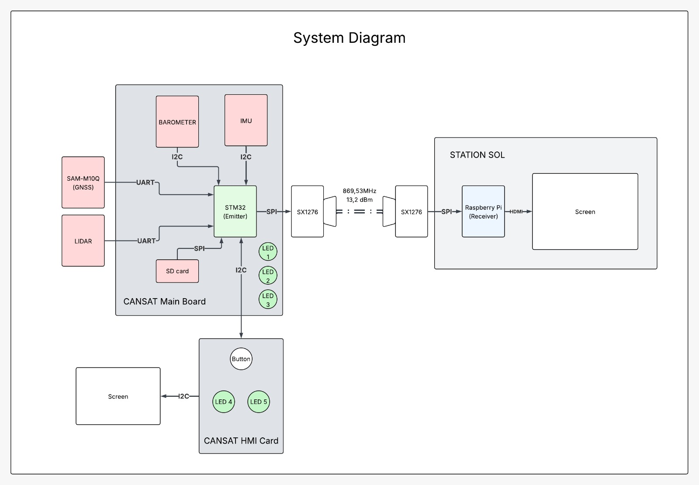  
  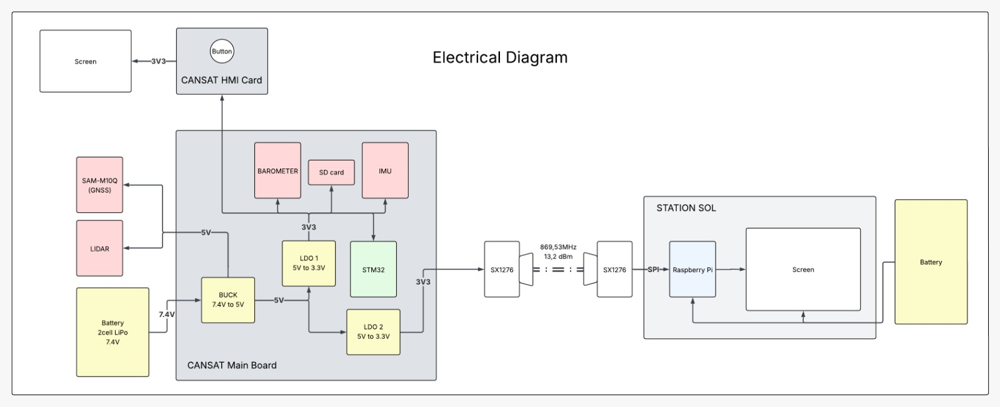

### 🔗 Used components description

All the blocks shown above will be implemented with the components listed below.

| Component | Reference | Description | Justification |
| :--- | :--- | :--- | :--- |
| **LoRa Module** | SX1276 | The SX1276/77/78/79 transceivers feature the LoRaTM long range modem that provides ultra-long range spread spectrum communication and high interference immunity whilst minimising current consumption. | Long range communications were required with a solid reliable interface, also it was recommended by last year’s CANSAT team from the school. | On the Mainboard PCB
| **LiDAR Altimeter** | LW20/C | A compact, IP67-rated laser altimeter from LightWare. It provides high-precision distance measurements up to 100 meters using time-of-flight technology, capable of multiple returns. | It allows accurate terrain mapping to accomplish one of the missions. |
| **Microcontroller (MCU)** | STM32G431CBU6 | A 32-bit ARM Cortex-M4 microcontroller by STMicroelectronics. It features mixed-signal capabilities, high-speed processing (170 MHz), and hardware mathematical accelerators (CORDIC/FMAC). | High processing speed is required for sensor fusion and real-time control loops, handling data faster and more efficiently than standard beginner boards. |
| **Barometer** | BMP581 | A high-precision absolute barometric pressure sensor. It is designed for mobile applications, offering low noise and low power consumption to measure atmospheric pressure. | Determining altitude and vertical velocity (descent rate). It is critical for triggering parachute deployment based on pressure changes. Also recommended from last year’s project. |
| **IMU (Inertial Measurement Unit)** | BNO055 | A 9-axis System in Package (SiP) integrating a triaxial 14-bit accelerometer, a triaxial 16-bit gyroscope with a range of ±2000 degrees per second, and a triaxial geomagnetic sensor. It includes a dedicated microcontroller for sensor fusion. | Provides orientation data (Euler angles, Quaternions) directly. The on-board sensor fusion offloads complex math from the main MCU, ensuring accurate angular position estimation. |
| **GNSS Module** | SAM-M10Q | A patch antenna module from u-blox featuring the M10 standard precision GNSS platform. It supports concurrent reception of four GNSS constellations (GPS, GLONASS, Galileo, and BeiDou). | Required for tracking the CanSat's trajectory and lateral movement. The concurrent reception ensures a faster "time-to-first-fix" and better positioning accuracy. Also provides redundancy for altitude estimation. |
| **Voltage Regulator (LDO)** | LDO40LPU33RY | A high-precision, low-dropout voltage regulator from STMicroelectronics. It provides a stable output with low quiescent current and low noise. | Used to provide a clean, stable 3.3V power line to sensitive electronics (like the MCU and sensors) filtering out noise that might come from the main power rail. |
| **Local Storage** | Micro SD Card + Molex 473092651 | A standard high-capacity non-volatile flash memory storage card interfaced via SPI or SDIO with the Molex 473092651 card reader. | Used to save a large amount of points and telemetry from the different sensors. It will be recording everything and setting timestamps on measurements. This will be the data that is recovered post-flight. |
| **Single Board Computer** | Raspberry Pi (Model 4 / Zero 2 W) | A low-cost, credit-card-sized computer that plugs into a computer monitor or TV, and uses a standard keyboard and mouse. It runs a Linux-based operating system. | Utilized for the Ground Station architecture. It processes the incoming telemetry stream, handles the graphical user interface (GUI) for data visualization, and stores mission logs. |
| **Battery** | 2-Cell LiPo (7.4V) | A Lithium Polymer rechargeable battery pack consisting of two cells in series, providing a nominal voltage of 7.4V and high discharge capabilities. | The 7.4V output is ideal for the input range of the voltage regulators, providing sufficient overhead to maintain stable power throughout the mission duration. |
| **Buck Converter** | LMR51625 | A wide-input, synchronous buck converter from Texas Instruments. It is designed to regulate high voltage inputs down to lower logic levels with high efficiency and a compact footprint. | Steps down the 7.4V battery voltage to 5V efficiently. Unlike linear regulators, this switching regulator minimizes heat generation and power loss. |
| **JST Connectors** | JST SH Vertical| Small plugin connector we used sizes from 3 to 7 pins | All of our components are connected thanks to JST SH connectors these are a good compromise between compactness and ease of use |

### 🔌 Electronic design
#### Mainboard PCB
The electronic architecture of the Vortex project is based on a “reverse engineering” process. Indeed, by analyzing and understanding last year’s project and more precisely last year’s PCB, we were able to identify the key points of the PCB and the components that needed to be modified. Due to this process, we chose all the components listed above to meet the evolving requirements of our missions and did the schematic.

  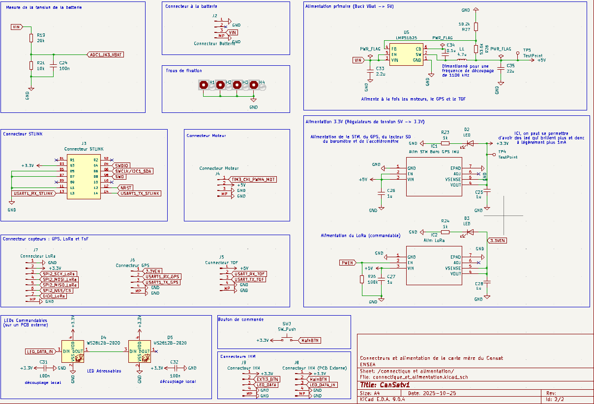  
  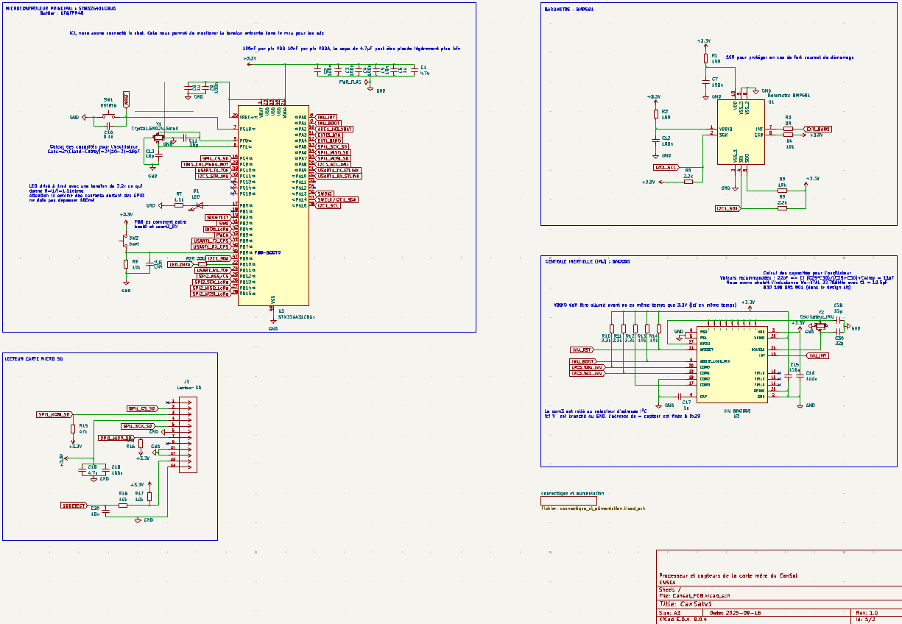

To integrate this high quantity of components within the restricted 33cl volume of the can, we developed a 6-layer PCB. The layers are organised as follows : 
1. Signal
2. GND
3. Signal
4. PWR
5. GND
6. Signal

Here is the final PCB :

  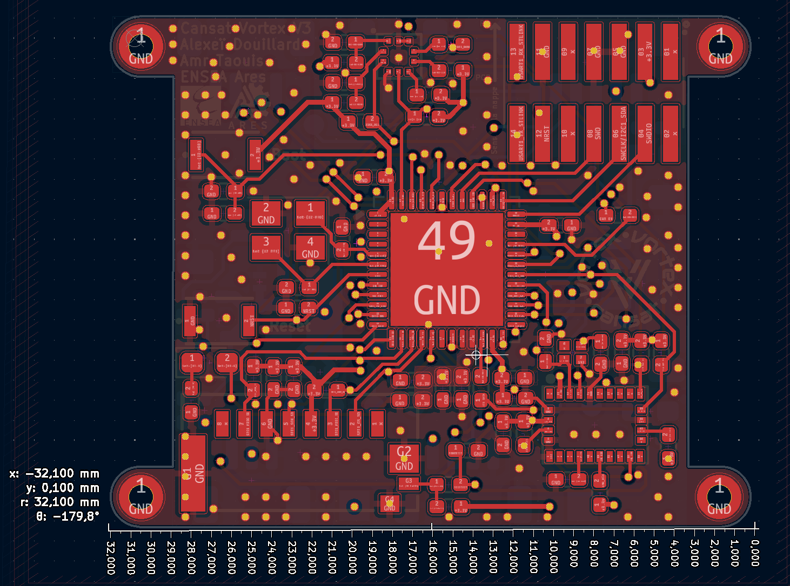  
  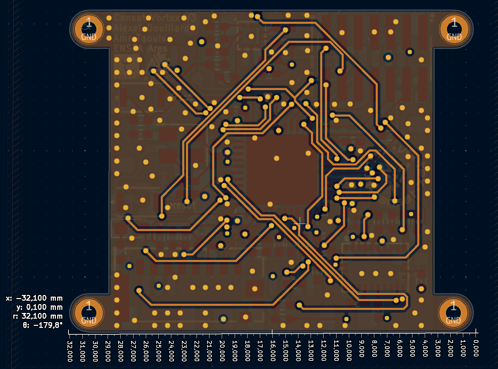  
  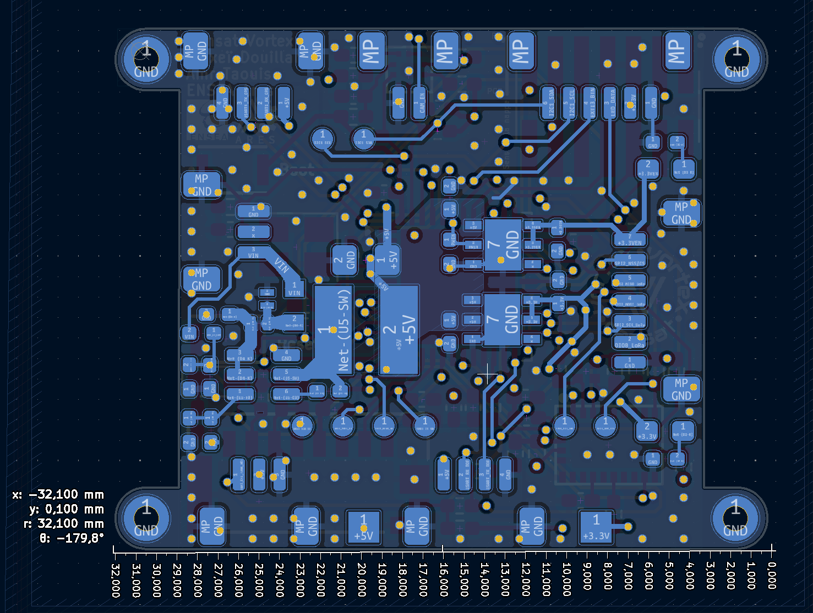

Here are the rendered 3d model of our PCB :

Front side : STM32 (center), Barometer (top), JTAG connector (top right), IMU (bottom right), SD card reader (bottom left), Status LED (left), Buttons (left), 
Whe have two oscillators; a 12 MHz clock for the STM on it's left and a 32.765 kHz clock for the IMU above the IMU.

  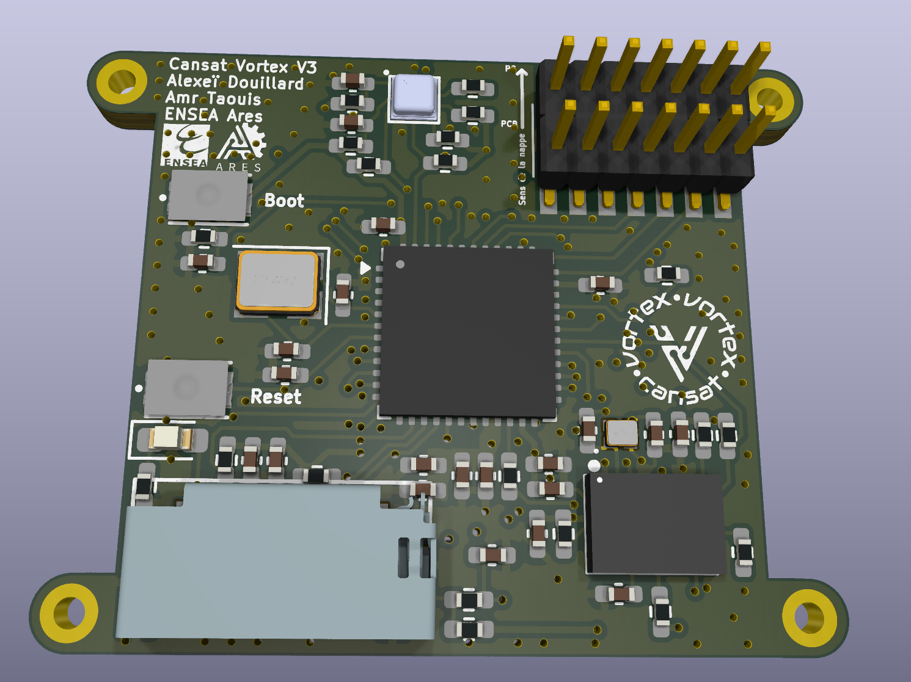

Back Side :
Vbat -> 5V Buck (top left), Main 3.3V LDO (center right), and 3.3V LDO for the LoRa module with an enable function (bottom left), Connectors to the external modules :
- Motor (top left)
- Time of Flight sensor (top right)
- LoRa module (right)
- HMI *see next section* (bottom right)
- GPS (bottom left)
- Battery 7.4V (right)

There are also two testpoints, one for them is to test the 5V (top left), the other is for the main 3.3V (top right).

  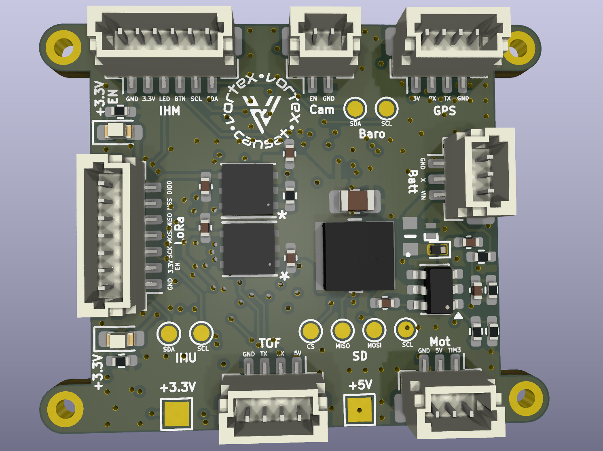

The assembly process began with the arrival of the V1 motherboard. We soldered the components and we successfully performed a test by programming and blinking an onboard LED. This test confirmed that the STM32G431CBU6 microcontroller was properly powered and that our clock and debug circuits were functional.

/!\ Warning ! The V1 Has a mistake in the buck's footprint we had to rewire it manually to ensure that uit could power the rest of the mainboard.The is also a mistake in the connection of 3.3V enabeled signal, the 3.3V power supply that can be triggerd is supposed to be linked to the LoRa connector, here it has mistakenly been connected to the GPS connector.
This has been fixed in the following versions (V2) and the latest version V3 is a cleaner version with added electrical security.

A Blinking blue LED controlled by the microcontroller,
The red LEDs mean that the LDO are working one is on by default, the other one was activated by the microcontroller here is the blinking V1 :

  

#### HMI PCB
We also developed a secondary HMI (Human-Machine Interface) PCB (2 layers). This PCB establishes an I2C link with the mainboard to control an onboard status screen. Moreover, the HMI PCB contains two addressable LEDs, providing a programmable visual feedback system to monitor the CanSat’s state before and during the launch.

  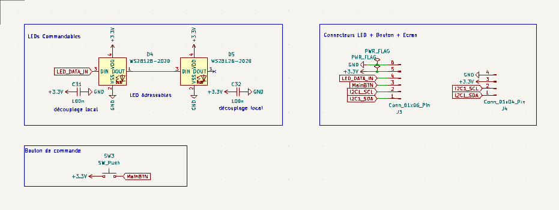  
  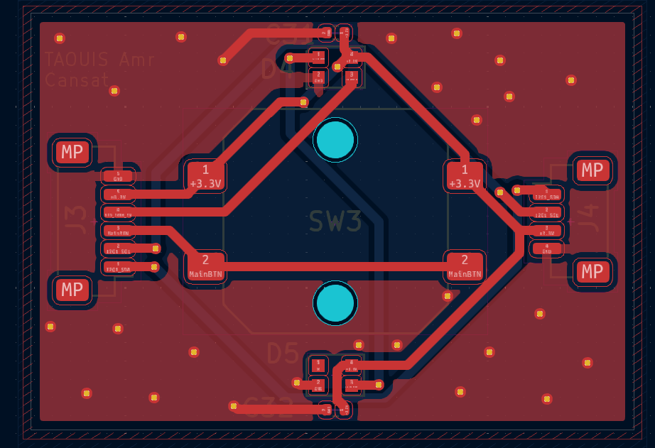  
  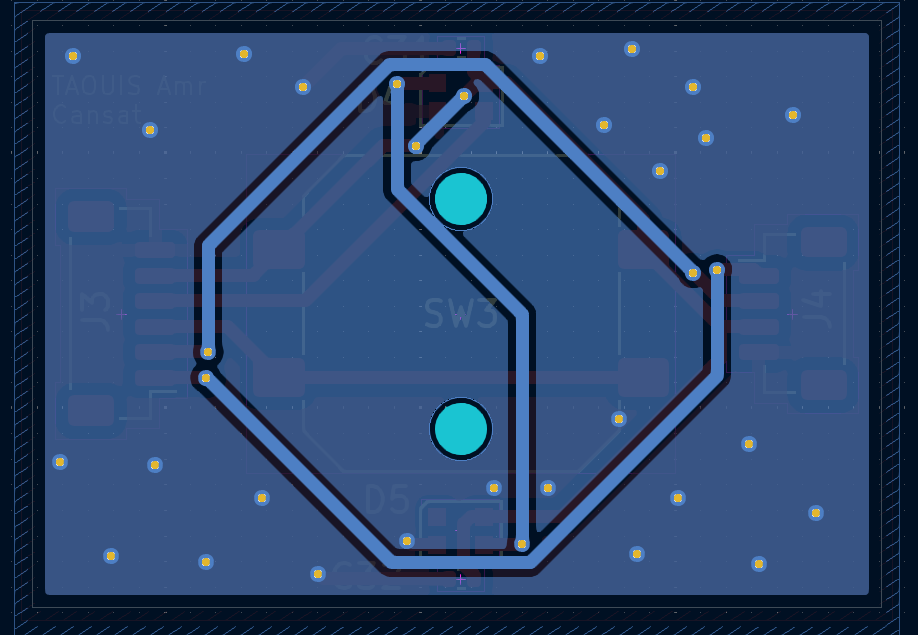

The HMI PCB was tested in integration with an OLED screen and a Nucleo development board. The display correctly shows the CanSat system status (LoRa link state, battery level), and the user can cycle through information screens using the onboard button. A short circuit between GND and 3.3V was detected after re-soldering a loose LED and was resolved. A custom enclosure for the HMI PCB and the OLED screen was also designed in OnShape, to hold them inside a handheld remote control casing. The next and final step for the HMI PCB is to connect it to the mainboard, which will allow the display to show the actual real-time status of the onboard components instead of test values.

  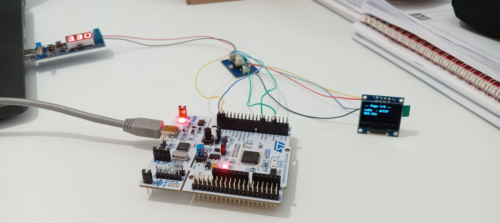  
  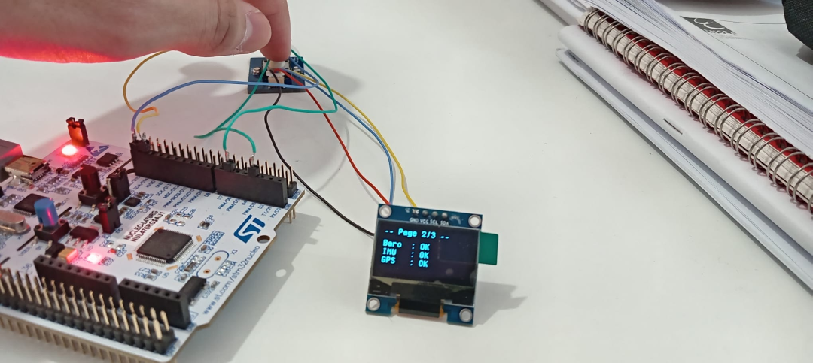  

### ⚙️ Mechanical Design

Our current strategy requires the body to have an open top where the main chute is covered by the drogue parachute. 

  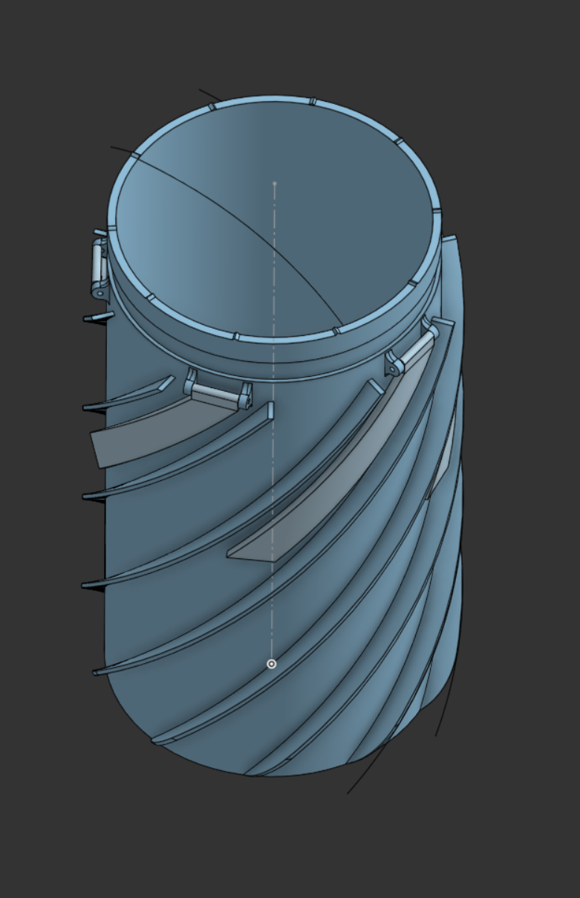

The drogue chute, is a kirigami inspired parachute *check the research paper in the ressources section* For now we only laser cutted the (a) design shown below because we found it's 3D model easly but we are working on creating a more optimised patern using a better cut patern

  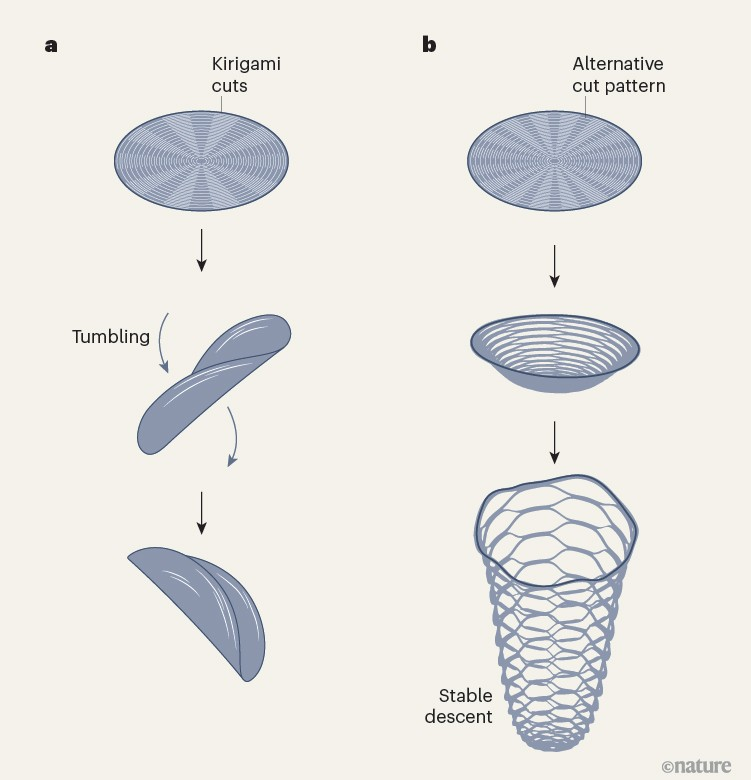

The parachute dimensions were calculated using the fundamental principle of dynamics at stabilized velocity (mg = ½ρC_dSV²). We have found a parachute surface area of approximately 0.116 m² and a diameter of approximately 0.385 m. We have decided to take a parachute with a diameter of 40 cm. This choice has been discussed and approved an aerospace research scientist.

For the topography mission we need to make the satellite spin thus we added several helixes to the body of the can this will induce a rotation so the TOF sensor can map the entire ground in a spiral patern.

  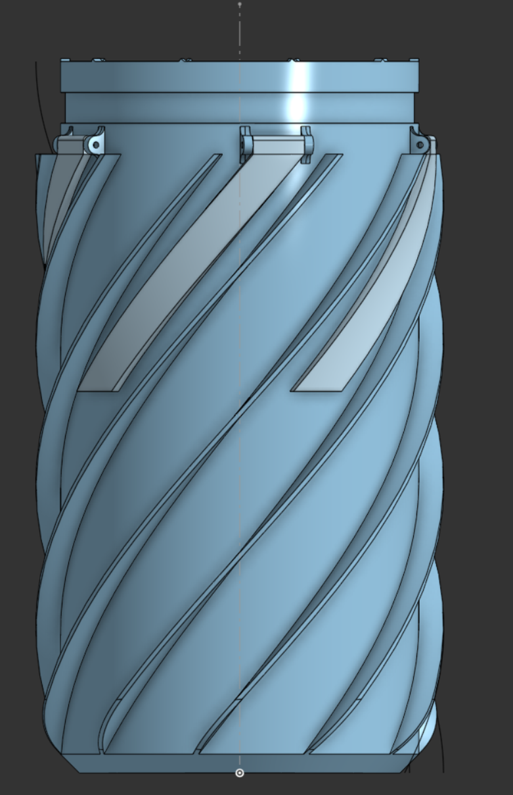

We added winglets that will deploy as the can falls and will be locked by small magnets, for now we are still trying to find the optimal shape of those winglets.

### 🧠 RTOS Software Architecture

To ensure deterministic execution, prevent data starvation, and synchronize our 3D topographical mapping, the CanSat's software is built on **FreeRTOS**. We implemented a **10Hz Unified Snapshot Architecture** where sensor data is gathered, fused, and dispatched to both the Ground Station and the onboard SD card simultaneously. 

The system is divided into four main concurrent tasks communicating safely via RTOS Queues (`qSensorEvents`, `qLoRa`, `qSDCard`):

#### 🧵 Task Management
- **`TaskFSM` (Normal Priority):** The brain of the satellite. It evaluates the flight state at 20Hz, handles LED visual feedback, and acts as the master metronome. Every 100ms (10Hz), it requests sensor readings and builds a unified `TelemetryPacket_t` to feed the communication and storage queues.
- **`TaskSensors` (High Priority):** The data gatherer. It processes hardware interrupts and I2C/UART streams to extract data from the BMP581 (Barometer with thermal feed-forward compensation), BNO055 (IMU Euler angles & Gyro), LW20/C (LiDAR distance), and SAM-M10Q (GNSS background parsing). 
- **`TaskLoRa` (Low Priority):** The communicator. Formats the unified telemetry struct into our custom `v2.3` comma-separated protocol and transmits it via the SX1276 module. It handles Standby broadcasts and guaranteed-delivery Calibration handshakes.
- **`TaskSDCard` (Low Priority):** The data logger. Utilizes the **FATFS** library over a custom low-level SPI driver to mount a MicroSD card and log a highly detailed `FLIGHT.CSV`. To prevent hardware bottlenecks during high-speed laser mapping, it uses an `f_sync()` batching algorithm, safely locking data to the silicon memory without crashing the RTOS.

#### 🔄 Finite State Machine (FSM)
The CanSat operates entirely autonomously. Flight states are evaluated dynamically based on environmental triggers detected by the sensor fusion (primarily combining the LiDAR and Barometer).

   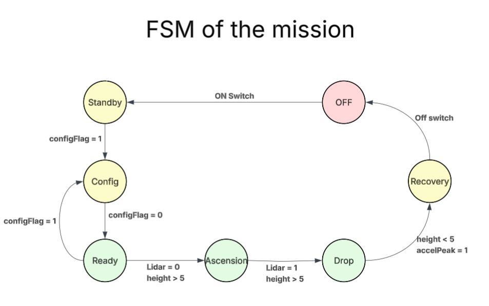

 

| State | Name | Description | In Transition | Out Transition | Power Supply | LIDAR | Barometer | GNSS | LoRa | IMU |
| :---: | :--- | :--- | :--- | :--- | :---: | :---: | :---: | :---: | :---: | :---: |
| **OFF** | Off state | The power supply switch is in OFF, everything is without power supply. | `powerSwitch = 0` | `powerSwitch = 1` | 🔴 OFF | 🔴 OFF | 🔴 OFF | 🔴 OFF | 🔴 OFF | 🔴 OFF |
| **S0** | Standby | Idle mode, waiting for config. Rest mode, low consumption. | `powerSwitch = 1` | `conFlag = 1` | 🟢 ON | 🔴 OFF | 🟢 ON | 🟢 ON | 🔴 OFF | 🔴 OFF |
| **S1** | Config | Configuration mode after connecting status interface. Waiting until unplugged. | `conFlag = 1` | `conFlag = 0` | 🟢 ON | 🟢 ON | 🟢 ON | 🟢 ON | 🟢 ON | 🟢 ON |
| **S2** | Ready | Waiting for the ascension or Configuration. | `conFlag = 0` | `lidar = 0` and `height > 5` | 🟢 ON | 🟢 ON (Low Power) | 🟢 ON | 🟢 ON | 🟢 ON | 🟢 ON |
| **S3** | Ascension | Ascending state, the device will be waiting for the drop. | `lidar = 0` and `height > 5` | `lidar = 1` and `height > 5` | 🟢 ON | 🟢 ON (Low Power) | 🟢 ON | 🟢 ON | 🟢 ON | 🟢 ON |
| **S4** | Drop | Descent state, all the sensors are ON. High consumption. | `lidar = 1` and `height > 5` | `height < 5` | 🟢 ON | 🟢 ON | 🟢 ON | 🟢 ON | 🟢 ON | 🟢 ON |
| **S5** | Recovery | Final steady state, waiting for recovery and data extraction. | `height < 5` | `powerSwitch = 0` | 🟢 ON | 🔴 OFF | 🔴 OFF | 🟢 ON | 🟢 ON | 🔴 OFF |

### 📊 Data Acquisition & Routing Flow

The CanSat's data pipeline is designed to be asynchronous, modular, and highly reliable. Data is gathered from four distinct hardware sensors across different communication buses, packaged into independent C-structures, and finally routed to our two main storage and transmission endpoints.

Here is the breakdown of the data acquisition architecture:

#### 1. Sensor Inputs & Protocols
The system continuously listens to four hardware interfaces:
* **GNSS (UART):** Receives continuous NMEA frames from the satellites.
* **Barometer (I2C):** Polled for highly precise atmospheric pressure and temperature.
* **IMU (I2C):** Polled for the onboard sensor-fused orientation and acceleration.
* **LIDAR (UART):** Receives high-speed distance measurements via time-of-flight laser pulses.

#### 2. Data Encapsulation (The Structs)
To keep the data organized and synchronized, each sensor's readings are immediately packed into a dedicated `struct`. Every struct includes a dedicated **timestamp string** captured the exact millisecond the data was read, ensuring perfect synchronization for post-flight analysis.

* **GNSS Struct:** `timestamp`, `latitude`, `longitude`, `altitude`, `satellites`
* **Barometer Struct:** `timestamp`, `height`, `temperature`
* **IMU Struct:** `timestamp`, `head` (yaw), `pitch`, `roll`, `accelX`, `accelY`, `accelZ`
* **LIDAR Struct:** `timestamp`, `distance`

#### 3. Data Destinations
Once the individual structures are populated, the FSM (Finite State Machine) gathers them into a single, unified master packet (`TelemetryPacket_t`). This unified snapshot is then dispatched simultaneously to two endpoints:

* 📡 **LoRa Module:** The data is serialized into a comma-separated string (our custom `v2.3` protocol) and broadcasted over the air at 10Hz to the Python Ground Station for real-time monitoring.
* 💾 **SD Card:** The exact same data is routed to the onboard FATFS SD Card via SPI. It is logged as a CSV file and locked into the physical silicon (`f_sync`) continuously, ensuring no data is lost upon impact.

### 📡 Communications & Software Architecture

The software and communication architecture of the Vortex project was developed with a primary focus on data integrity and link stability, treating the telemetry stream as the mission's critical lifeline. Following a reverse-engineering analysis of the previous team's communication structure, we opted to rebuild the data transmission system to improve packet efficiency and error handling. The solution was implemented with SX1276 module shown above. To ensure the reliability of the received data, we integrated a Cyclic Redundancy Check (CRC) mechanism, which validates packet integrity before parsing begins at the Ground Station.

On the navigation front, the software driver for the SAM-M10Q GNSS module was designed to parse specific NMEA frames (GNGGA, GNGSA, and GNRMC) to extract 3D positioning, velocity, and satellite data. We used the u-center2 software for initial configuration, enabling SBAS/EGNOS support to maximize positioning accuracy. Testing has been iterative, moving from indoor functional verification to long-range outdoor link tests to validate the link budget.
- **Summary**

  - **Robust LoRa Protocol**
  - **Error Handling:** Implemented CRC (Cyclic Redundancy Check) and header validation to automatically discard corrupted frames at the Ground Station.
  - **Handshaking:** Established a connection verification sequence ("CANSAT OK") to confirm receiver readiness before mission start.

- **Advanced GNSS Integration**
  - **NMEA Parsing:** Configured the STM32 to parse specific NMEA sentences:
  - **GNGGA:** Global Position (Latitude, Longitude, Altitude).
  - **GNRMC:** Recommended Minimum Navigation Information.
  - **GNGSA:** DOP and active satellites.
  - **Accuracy Optimization:** Activated SBAS/EGNOS support via u-center2 to enhance vertical and horizontal precision.

- **Testing & Validation**
  - **GNSS Precision:** Conducted comparative tests between indoor (cold start) and outdoor environments to verify "Time-To-First-Fix" and coordinate stability. Confirming that outdoors' performance is better.
  - **Range Testing:** Performed Line-of-Sight (LoS) tests between the CanSat emitter and Ground Station receiver to validate the LoRa link budget and antenna performance at distance.

**Current Status:** Finalizing the integration of the IMU values into the main telemetry stream.

### 🧰 Ground Station

It is going to be our mission control, from which we will process the data sent by the CanSat. It is made of a screen and a Raspberry Pi 5.

  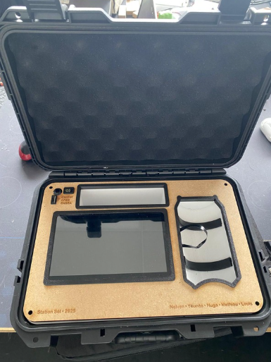

We devised a graphical user interface using an STM32, to be able to view the received data in real-time.

  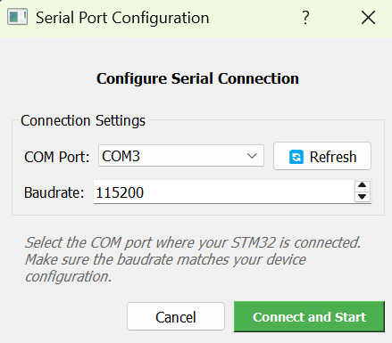  
  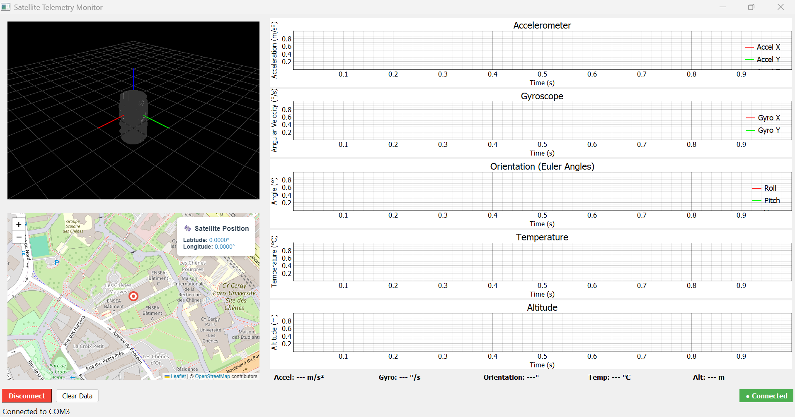

It displays the CanSat's orientation, its location and various other parameters such as its altitude. We still have not tested this GUI and will have to do it once the transmissions are established. 

We are also working on changing the ground station's appearance so that our names will be written on it.

### 🍃 Wind Tunnel

For reliably testing the parachute we constructed a wind tunnel that uses two 350W conter-rotative drone motors.

  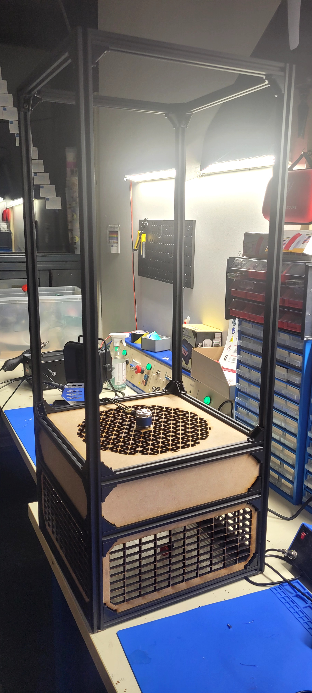

The device is powered by an 12V powersupply cased in a PLA box :

  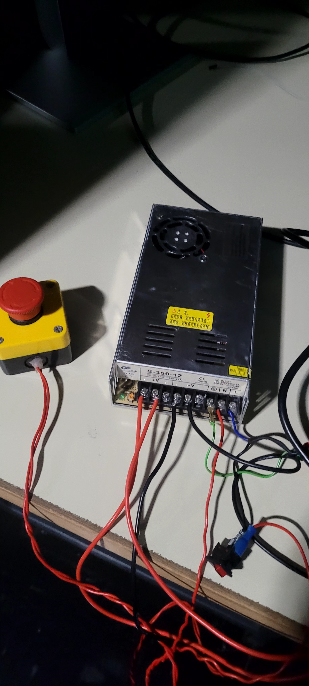
  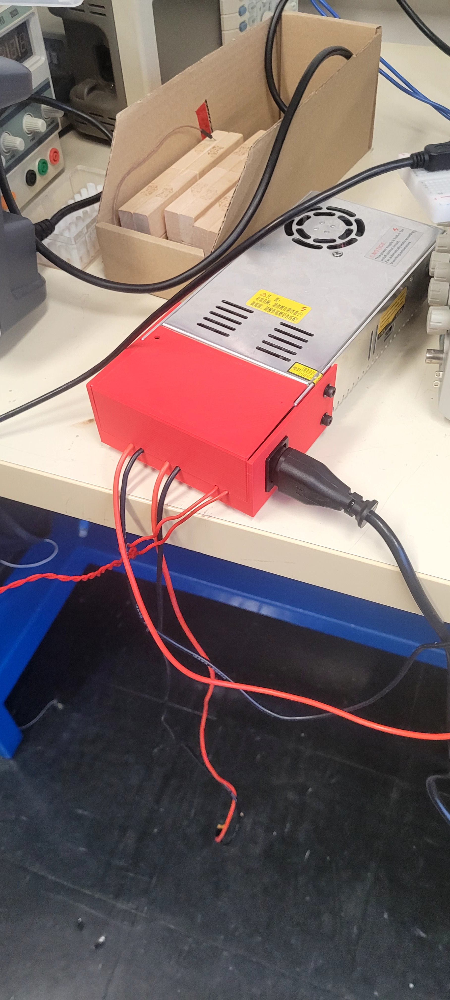

It still needs a protection from the spinning motor but the windtunnel seem to have more than enough power to simulate a freefall :

A one fan test :

  

Here is the whole prototype setup :

  

## 📚 Resources and useful links

### 👾 Used software 

- UCenter 2 - GNSS
- Lightware Studio - LIDAR
- STM32CubeIDE V.1.19.0 - STM32
- KiCAD - PCB Design
- OnShape - 3D modeling

### 🔗 Links 

- [Previous ENSEA CanSat GitHub](https://github.com/mathieupommery/CANSAT_ARES_ENSEA)
- [Onshape Docs](https://cad.onshape.com/documents?resourceType=folder&nodeId=558406456f078be48d4c722b&column=modifiedAt&sortOrder=asc)
- [Kirigami inspierd parachute](https://www.nature.com/articles/s41586-025-09515-9#Fig1)
- [FreeRTOS Guide](https://www.youtube.com/watch?v=OPrcpbKNSjU) 
---

###  🚀 Future plans
The next steps will be :

- [ ] Create a V2 for the mainboard that includes outputs to a mini screen, fixes the buck's footprint, adds testpoints for the IMU and barometer.
- [ ] Test the current Cansat Body in the wind tunnel
- [ ] Write the code for the barometer and accelerometer
- [ ] Test the ToF sensor

From the current state of progress we expect to end the project in time with all of the missions.
