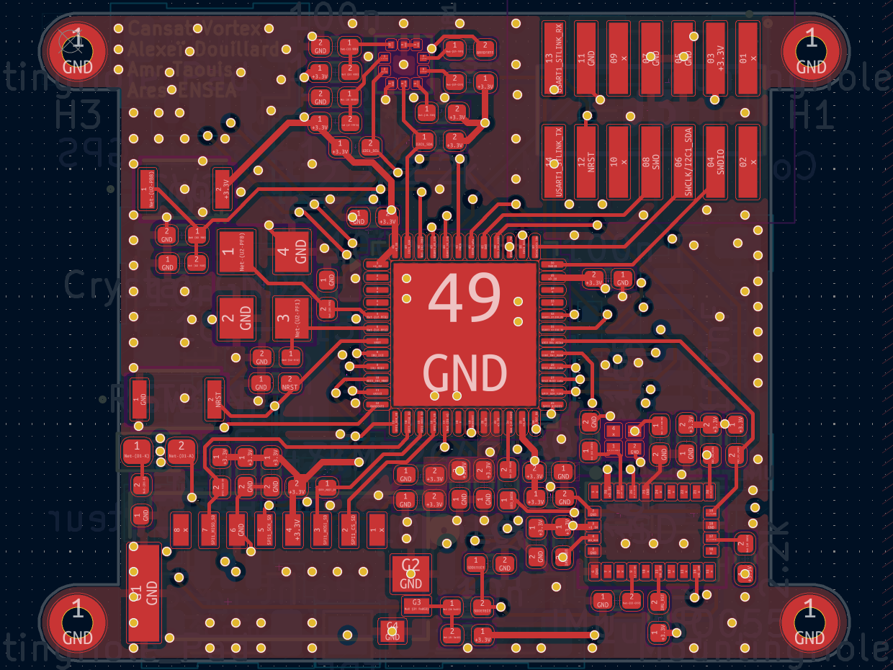
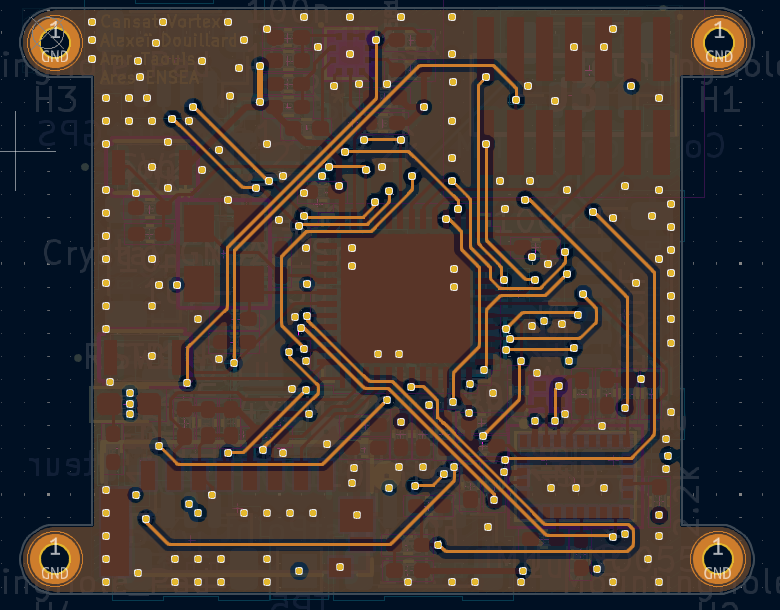
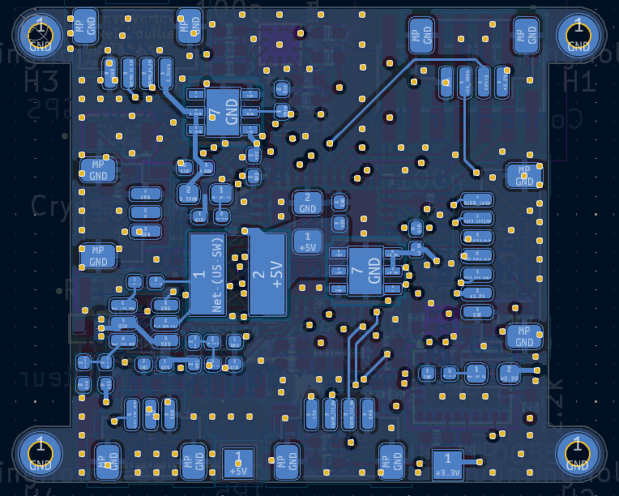

# 🛰️CanSat 2025-2026
    

> **ENSEA's CanSat team project for the 2025–2026 edition .**

We are a team of of second year engeneering students at ENSEA and we will attend the 2025-2026 edition of the CanSat competition. CanSat competitions challenge teams to design, build, and launch a can-sized (33 cl) satellite that completes scientific or engineering missions during descent.

This year's missions are listed below :

- **Main Mission (Mandatory)**
   - **Mission 1: Deployment and Landing**
       - **Integration**: The CanSat must be equipped with a parachute located inside the device, designed to deploy during flight.

       - **Deployment**: The CanSat must successfully deploy its parachute at an altitude between 75 and 90 meters.

- **Secondary Missions (Optional)**
    - **Mission 2: Downsizing**
    **Reducing** the CanSat to a 33cl format will allow the team to double its score on the technical section.

    - **Mission 3: Ground Study**
    Conduct a study of a topographical feature during the flight.

    - **Mission 4: Onboard Camera**
    Record a video of the parachute deployment or the CanSat’s landing.

- **Bonus Mission**
    -  During the descent or following the landing, the CanSat may perform an additional mission. Its evaluation will be at the jury's discretion. It must be validated by the controllers during the RCE1 to ensure compliance with the rules.

And finally, here's the list of team members and their roles :

| Name | Role |
|------|------|
| Alexeï DOUILLARD | 3D Modeling, Satellite integration |
| Juan Pablo BARONA CIFUENTES | Communications |
| Ted KOYAZANDE | Ground Station |
| Amr TAOUIS | PCB Design |
| Abdelmoughit HAJJI LAAMOURI | Code and Firmware |

---

## 📋 Objective 

We then defined our own objectives based on the missions we chose to fulfill among the previously mentionned missions. 

- **Main Mission (Mandatory)**
  - Devise a kirigami inspired drogue chute which will act as a protective cap on the CanSat. It will be used to deploy the main parachute. The drogue chute will be released thanks to a string and an elastic band tied to a servomotor and will deploy the main parachute.

- **Secondary Missions**

  - **Mission 2** : Downsizing
    - Fit everything under a 330mL limit and a 350g limit
  
  - **Mission 3** : Ground study
    - **Plan A** :
      Use a 100m time of flight (TOF) sensor to map the ground.
      Induce a rotation thanks to an helicoïdal-shaped can.
      Precisely place the mapped point with the help of an Inertial Measurment Unit (IMU) and a barometer.
    - **Plan B** :
Use a high resolution camera to film the whole descent
Create a topological map thanks to an AI after the mission.
  - **Mission 4: Onboard Camera**
    - Record the landing using a small independent mini camera
- **Bonus Mission**
  - Display all recorded data and live feed of the descend to the ground station.

In order to simulate our can's movement during its descent, we will also devise a wind tunnel.

## 🔧 Development

The development section is divided in 4 parts:
- Block diagram
- Explanation of components
- Technical sections
- Used software

So first, it's required to show the Block diagram of the solution to understand how the project is being developed.

### 💡 Block diagram of the solution

### 🔗 Used components description

All the blocks shown above will be implemented with the components listed below.

| Component | Reference | Description | Justification |
| :--- | :--- | :--- | :--- |
| **LoRa Module** | SX1276 | The SX1276/77/78/79 transceivers feature the LoRaTM long range modem that provides ultra-long range spread spectrum communication and high interference immunity whilst minimising current consumption. | Long range communications were required with a solid reliable interface, also it was recommended by last year’s CANSAT team from the school. | On the Mainboard PCB
| **LiDAR Altimeter** | LW20/C | A compact, IP67-rated laser altimeter from LightWare. It provides high-precision distance measurements up to 100 meters using time-of-flight technology, capable of multiple returns. | It allows accurate terrain mapping to accomplish one of the missions. |
| **Microcontroller (MCU)** | STM32G431CBU6 | A 32-bit ARM Cortex-M4 microcontroller by STMicroelectronics. It features mixed-signal capabilities, high-speed processing (170 MHz), and hardware mathematical accelerators (CORDIC/FMAC). | High processing speed is required for sensor fusion and real-time control loops, handling data faster and more efficiently than standard beginner boards. |
| **Barometer** | BMP581 | A high-precision absolute barometric pressure sensor. It is designed for mobile applications, offering low noise and low power consumption to measure atmospheric pressure. | Determining altitude and vertical velocity (descent rate). It is critical for triggering parachute deployment based on pressure changes. Also recommended from last year’s project. |
| **IMU (Inertial Measurement Unit)** | BNO055 | A 9-axis System in Package (SiP) integrating a triaxial 14-bit accelerometer, a triaxial 16-bit gyroscope with a range of ±2000 degrees per second, and a triaxial geomagnetic sensor. It includes a dedicated microcontroller for sensor fusion. | Provides orientation data (Euler angles, Quaternions) directly. The on-board sensor fusion offloads complex math from the main MCU, ensuring accurate angular position estimation. |
| **GNSS Module** | SAM-M10Q | A patch antenna module from u-blox featuring the M10 standard precision GNSS platform. It supports concurrent reception of four GNSS constellations (GPS, GLONASS, Galileo, and BeiDou). | Required for tracking the CanSat's trajectory and lateral movement. The concurrent reception ensures a faster "time-to-first-fix" and better positioning accuracy. Also provides redundancy for altitude estimation. |
| **Voltage Regulator (LDO)** | LDO40LPU33RY | A high-precision, low-dropout voltage regulator from STMicroelectronics. It provides a stable output with low quiescent current and low noise. | Used to provide a clean, stable 3.3V power line to sensitive electronics (like the MCU and sensors) filtering out noise that might come from the main power rail. |
| **Local Storage** | Micro SD Card + Molex 473092651 | A standard high-capacity non-volatile flash memory storage card interfaced via SPI or SDIO with the Molex 473092651 card reader. | Used to save a large amount of points and telemetry from the different sensors. It will be recording everything and setting timestamps on measurements. This will be the data that is recovered post-flight. |
| **Single Board Computer** | Raspberry Pi (Model 4 / Zero 2 W) | A low-cost, credit-card-sized computer that plugs into a computer monitor or TV, and uses a standard keyboard and mouse. It runs a Linux-based operating system. | Utilized for the Ground Station architecture. It processes the incoming telemetry stream, handles the graphical user interface (GUI) for data visualization, and stores mission logs. |
| **Battery** | 2-Cell LiPo (7.4V) | A Lithium Polymer rechargeable battery pack consisting of two cells in series, providing a nominal voltage of 7.4V and high discharge capabilities. | The 7.4V output is ideal for the input range of the voltage regulators, providing sufficient overhead to maintain stable power throughout the mission duration. |
| **Buck Converter** | LMR51625 | A wide-input, synchronous buck converter from Texas Instruments. It is designed to regulate high voltage inputs down to lower logic levels with high efficiency and a compact footprint. | Steps down the 7.4V battery voltage to 5V efficiently. Unlike linear regulators, this switching regulator minimizes heat generation and power loss. |

### Electronic design

The electronic architecture of the Vortex project is based on a “reverse engineering” process. Indeed, by analyzing and understanding last year’s project and more precisely last year’s PCB, we were able to identify the key points of the PCB and the components that needed to be modified. Due to this process, we chose all the components listed above to meet the evolving requirements of our missions and did the schematic.

To integrate this high quantity of components within the restricted 33cl volume of the can, we developed a 6-layer PCB. The layers are organised as follows : 
1 - Signal
2 - GND
3 - Signal
4 - PWR
5 - GND
6 - Signal

We also developed a secondary HMI (Human-Machine Interface) PCB (2 layers). This PCB establishes an I2C link with the mainboard to control an onboard status screen. Moreover, the HMI PCB contains two addressable LEDs, providing a programmable visual feedback system to monitor the CanSat’s state before and during the launch.

The assembly process began with the arrival of the V1 motherboard. We soldered the components and we successfully performed a test by programming and blinking an onboard LED. This test confirmed that the STM32G431CBU6 microcontroller was properly powered and that our clock and debug circuits were functional.

In parallel with the electronic validation, we have begun wind tunnel preparation to evaluate the mechanical and aerodynamic behavior of the CanSat. The electronics of the wind turbine is quite simple we use two drone motors t

The testing process of the IHM pcb was not possible yet because it has not yet been delivered.

### 📡 Communications & Software Architecture

The software and communication architecture of the Vortex project was developed with a primary focus on data integrity and link stability, treating the telemetry stream as the mission's critical lifeline. Following a reverse-engineering analysis of the previous team's communication structure, we opted to rebuild the data transmission system to improve packet efficiency and error handling. The solution was implemented with SX1276 module shown above. To ensure the reliability of the received data, we integrated a Cyclic Redundancy Check (CRC) mechanism, which validates packet integrity before parsing begins at the Ground Station.

On the navigation front, the software driver for the SAM-M10Q GNSS module was designed to parse specific NMEA frames (GNGGA, GNGSA, and GNRMC) to extract 3D positioning, velocity, and satellite data. We used the u-center2 software for initial configuration, enabling SBAS/EGNOS support to maximize positioning accuracy. Testing has been iterative, moving from indoor functional verification to long-range outdoor link tests to validate the link budget.
- **Summary**

  - **Robust LoRa Protocol**
  - **Error Handling:** Implemented CRC (Cyclic Redundancy Check) and header validation to automatically discard corrupted frames at the Ground Station.
  - **Handshaking:** Established a connection verification sequence ("CANSAT OK") to confirm receiver readiness before mission start.

- **Advanced GNSS Integration**
  - **NMEA Parsing:** Configured the STM32 to parse specific NMEA sentences:
  - **GNGGA:** Global Position (Latitude, Longitude, Altitude).
  - **GNRMC:** Recommended Minimum Navigation Information.
  - **GNGSA:** DOP and active satellites.
  - **Accuracy Optimization:** Activated SBAS/EGNOS support via u-center2 to enhance vertical and horizontal precision.

- **Testing & Validation**
  - **GNSS Precision:** Conducted comparative tests between indoor (cold start) and outdoor environments to verify "Time-To-First-Fix" and coordinate stability. Confirming that outdoors' performance is better.
  - **Range Testing:** Performed Line-of-Sight (LoS) tests between the CanSat emitter and Ground Station receiver to validate the LoRa link budget and antenna performance at distance.

**Current Status:** Finalizing the integration of the IMU values into the main telemetry stream.

### Ground Station

It is going to be our mission control, from which we will process the data sent by the CanSat. It is made of a screen and a Raspberry Pi 5.

We devised a graphical user interface using an STM32, to be able to view the received data in real-time.

It displays the CanSat's orientation, its location and various other parameters such as its altitude. We still have not tested this GUI and will have to do it once the transmissions are established. 

We are also working on changing the ground station's appearance so that our names will be written on it.

### 👾 Used software 

- UCenter 2 - GNSS
- Lightware Studio - LIDAR
- STM32CubeIDE V.1.19.0 - STM32
- KiCAD - PCB Design
- OnShape - 3D modeling

---
