# 🛰️ CanSat 2025-2026
   
> **ENSEA's CanSat team project for the 2025–2026 C'Space edition**

We are a team of second-year engineering students at ENSEA taking part in the 2025–2026 edition of the CanSat competition. CanSat competitions challenge teams to design, build and launch a can-sized (33 cl) satellite that carries out scientific or engineering missions during its descent.

This year's missions are listed below:

- **Main Mission (Mandatory)**
   - **Mission 1: Deployment and Landing**
       - **Integration**: The CanSat must be equipped with a parachute stowed inside the device, designed to deploy during flight.
       - **Deployment**: The CanSat must successfully deploy its parachute at an altitude between 75 and 90 meters.

- **Secondary Missions (Optional)**
    - **Mission 2: Downsizing**
    **Reducing** the CanSat to a 33 cl format doubles the team's score on the technical section.

    - **Mission 3: Ground Study**
    Conduct a study of a topographical feature during the flight.

    - **Mission 4: Onboard Camera**
    Record a video of the parachute deployment or of the CanSat's landing.

- **Bonus Mission**
    - During the descent or after landing, the CanSat may perform an additional mission. Its evaluation is at the jury's discretion, and it must be validated by the controllers during RCE1 to ensure compliance with the rules.

And finally, here is the list of team members and their roles:

| Name | Role |
|------|------|
| Alexeï DOUILLARD | 3D Modeling, Satellite integration, PCB |
| Juan Pablo BARONA CIFUENTES | Embedded systems, firmware |
| Ted KOYAZANDE | Ground Station, Communications |
| Amr TAOUIS | PCB Design and testing |
| Abdelmoughit HAJJI LAAMOURI | Code |

---

## 📋 Table of Contents

- [Objectives](#-objectives)
- [Project Structure](#-project-structure)
- [Development](#-development)
  - [Block diagram of the solution](#-block-diagram-of-the-solution)
  - [Used components description](#-used-components-description)
  - [Electronic design](#-electronic-design)
  - [Mechanical design](#%EF%B8%8F-mechanical-design)
  - [RTOS software architecture](#-rtos-software-architecture)
  - [Data acquisition & routing flow](#-data-acquisition--routing-flow)
  - [Communications & software architecture](#-communications--software-architecture)
  - [Ground Station](#-ground-station-mission-control-center)
  - [Telemetry analysis & 3D terrain reconstruction](#-telemetry-analysis--3d-terrain-reconstruction)
  - [Wind tunnel](#-wind-tunnel)
  - [Drone](#%EF%B8%8F-drone)
- [Resources and useful links](#-resources-and-useful-links)
- [Future plans](#-future-plans)

---

## 📋 Objectives

Based on the missions we chose to fulfill among those listed above, we defined the following objectives.

- **Main Mission (Mandatory)**
  - Design a kirigami-inspired drogue chute that also acts as a protective cap on the CanSat and is used to extract the main parachute. The drogue chute is released by a string and an elastic band tied to a servomotor; the whole mechanism is tested in a homemade wind tunnel.

- **Secondary Missions**
  - **Mission 2: Downsizing**
    - Fit everything within the 330 mL / 350 g limits, using a 6-layer PCB and a very lightweight parachute.

  - **Mission 3: Ground study**
    - **Plan A** (currently active):
      Use a 100 m time-of-flight (ToF) LiDAR to map the ground.
      Induce a rotation thanks to a helicoidal-shaped can, so the beam sweeps the terrain in a spiral as the CanSat falls.
      Georeference each measured point using an Inertial Measurement Unit (IMU), a barometer and a GNSS receiver. The wind tunnel is also used to validate that the can shape actually spins.
    - **Plan B**:
      Use a high-resolution camera to film the whole descent and build a topographical map with AI-based reconstruction after the mission.
  - **Mission 4: Onboard Camera**
    - Record the landing using a small self-contained mini camera.
- **Bonus Mission**
  - Stream part of the recorded data to the ground station during the descent, within the transmission rate of our LoRa module.

## 📁 Project Structure

```
2526_Projet2A_Cansat/
│
├── 📖 README.md                     # This file — project overview
├── 📖 README_GUI.md                 # Ground segment & data pipeline documentation
├── 📄 logs.md                       # Session-by-session work log
│
├── 💻 Firmware/satellite_telemetry/
│   ├── Cansat_V1/                   # STM32CubeIDE project — current flight firmware
│   ├── Cansat_V3/                   # Next firmware iteration (in progress)
│   ├── GUI/                         # Ground station application (Raspberry Pi 5, PyQt5)
│   └── Analysis_Tools/              # Legacy analysis scripts (superseded by 3D/)
│
├── 📂 3D/                           # Post-flight analysis & LIDAR point cloud pipeline
│   ├── cloudPoints.py               # 3D terrain point cloud (main tool)
│   ├── distanceDistribution.py      # LIDAR range histogram
│   ├── generate_sample_data.py      # Synthetic test data generator
│   ├── lidar_common.py              # Shared loading / cleaning / georeferencing
│   ├── COMMANDES.txt                # Full CLI reference
│   └── Analysis_Tools/              # Telemetry dashboards & physics analyses
│
├── ⚡ Hardware/
│   ├── PCB/                         # KiCad projects: Mainboard V1/V2/V3, HMI, custom libraries
│   └── 3D_Modeling/                 # Mechanical schematic & STL exports
│
├── 📂 backup data cansat/           # Real SD-card datasets from field tests
├── 🖼️ IMG/                          # Pictures used by the documentation
├── 📂 Documents/                    # SCAE documents, pictures, definition dossier
├── 📂 Reports/                      # Project reports (PDF)
└── 📂 Wind turbine/                 # Wind tunnel documentation & CFD attempt
```

## 🔧 Development

The development section is divided into four parts:
- Block diagram
- Explanation of the components
- Technical sections
- Software used

First, here is the block diagram of the solution, which shows how the project is organized.

### 💡 Block diagram of the solution

<div align="center">
  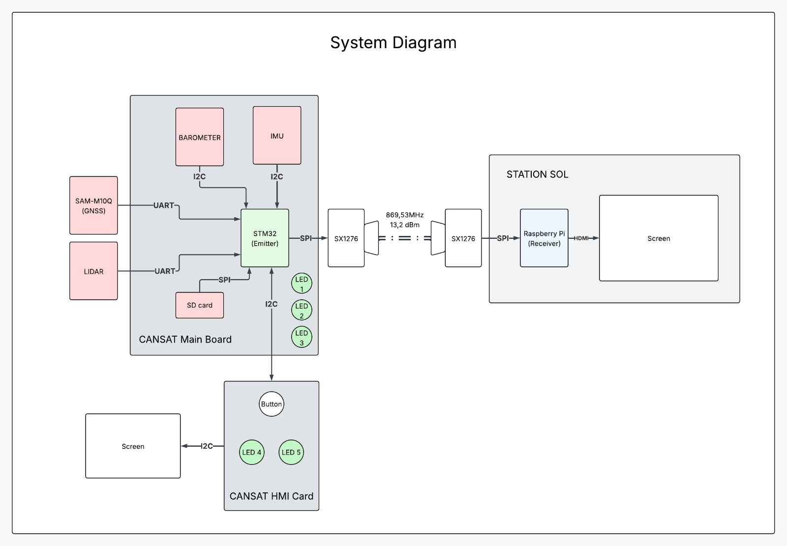<br><br>
  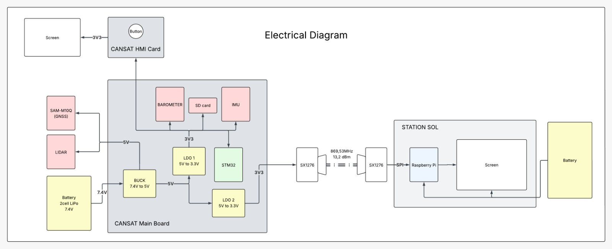
</div>

### 🔗 Used components description

All the blocks shown above are implemented with the components listed below.

| Component | Reference | Description | Justification |
| :--- | :--- | :--- | :--- |
| **LoRa Module** | SX1276 | The SX1276/77/78/79 transceivers feature the LoRa™ long-range modem, providing ultra-long-range spread-spectrum communication and high interference immunity while minimizing current consumption. | Long-range communication was required with a solid, reliable interface; it was also recommended by last year's CanSat team from the school. Mounted on the mainboard PCB. |
| **LiDAR Altimeter** | LW20/C | A compact, IP67-rated laser altimeter from LightWare. It provides high-precision distance measurements up to 100 meters using time-of-flight technology, and supports multiple returns. | Enables accurate terrain mapping for the ground study mission. |
| **Microcontroller (MCU)** | STM32G431CBU6 | A 32-bit ARM Cortex-M4 microcontroller by STMicroelectronics, featuring mixed-signal capabilities, high-speed processing (170 MHz) and hardware mathematical accelerators (CORDIC/FMAC). | High processing speed is required for sensor fusion and real-time control loops, handling data faster and more efficiently than typical beginner boards. |
| **Barometer** | BMP581 | A high-precision absolute barometric pressure sensor designed for mobile applications, offering low noise and low power consumption. | Determines altitude and vertical velocity (descent rate). It is critical for triggering parachute deployment based on pressure changes. Also recommended by last year's team. |
| **IMU (Inertial Measurement Unit)** | BNO055 | A 9-axis System-in-Package integrating a triaxial 14-bit accelerometer, a triaxial 16-bit gyroscope (±2000 °/s) and a triaxial geomagnetic sensor, with a dedicated microcontroller running the sensor fusion. | Provides orientation data (Euler angles, quaternions) directly. The onboard sensor fusion offloads complex math from the main MCU, ensuring accurate attitude estimation. |
| **GNSS Module** | SAM-M10Q | A patch-antenna module from u-blox featuring the M10 standard-precision GNSS platform. It supports concurrent reception of four GNSS constellations (GPS, GLONASS, Galileo and BeiDou). | Required to track the CanSat's trajectory and lateral drift. Concurrent reception ensures a faster time-to-first-fix and better positioning accuracy, and it provides a redundant altitude source. |
| **Voltage Regulator (LDO)** | LDO40LPU33RY | A high-precision, low-dropout voltage regulator from STMicroelectronics providing a stable output with low quiescent current and low noise. | Provides a clean, stable 3.3 V rail to the sensitive electronics (MCU and sensors), filtering out noise coming from the main power rail. |
| **Local Storage** | MicroSD card + Molex 473092651 | A standard high-capacity non-volatile flash storage card interfaced over SPI through the Molex 473092651 card reader. | Stores the full sensor telemetry and the high-rate LiDAR stream with timestamps. This is the data recovered post-flight for analysis and terrain reconstruction. |
| **Single-Board Computer** | Raspberry Pi 5 | A low-cost, credit-card-sized computer running a Linux-based operating system. | Hosts the ground station: it processes the incoming telemetry stream, runs the graphical user interface (GUI) for data visualization and stores the mission logs. |
| **Battery** | 2-cell LiPo (7.4 V), 2 × 500 mAh | A lithium-polymer rechargeable battery pack of two cells in series, providing a nominal 7.4 V and high discharge capability. | The 7.4 V output matches the input range of the voltage regulators, providing enough headroom to maintain stable power throughout the mission. |
| **Buck Converter** | LMR51625 | A wide-input synchronous buck converter from Texas Instruments, designed to step high input voltages down to logic levels with high efficiency in a compact footprint. | Steps the 7.4 V battery voltage down to 5 V efficiently. Unlike a linear regulator, this switching regulator minimizes heat generation and power loss. |
| **JST Connectors** | JST SH vertical | Small board-to-wire connectors, used in 3- to 7-pin variants. Thanks JST for the samples! | All external modules are connected through JST SH connectors — a good compromise between compactness and ease of use. |
| **Camera** | Drone camera | HD camera module salvaged from a drone, with a 2.4 GHz receiver and an SD card reader, powered by a separate 500 mAh 3.4 V battery. | We found two very similar HD cameras from cheap drones; one only works through a Wi-Fi app while the other one is controllable via UART. |

### 🔌 Electronic design
#### Mainboard PCB
The electronic architecture of the Vortex project is based on a reverse-engineering process. By analyzing last year's project — and more precisely last year's PCB — we identified the key points of the design and the components that needed to change. Based on this process, we selected the components listed above to meet the requirements of our missions and drew the schematic.

<div align="center">
  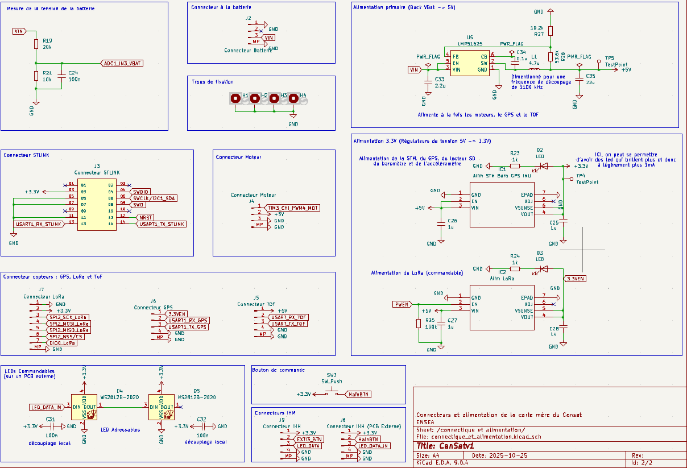<br><br>
  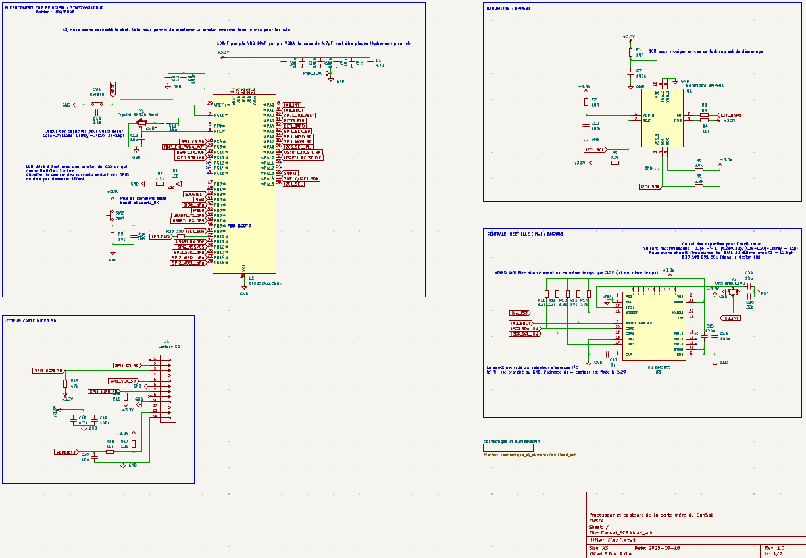
</div>

To integrate this large number of components within the restricted 33 cl volume of the can, we developed a 6-layer PCB. The stack-up is organized as follows:
1. Signal
2. GND
3. Signal
4. PWR
5. GND
6. Signal

Here is the final PCB:

<div align="center">
  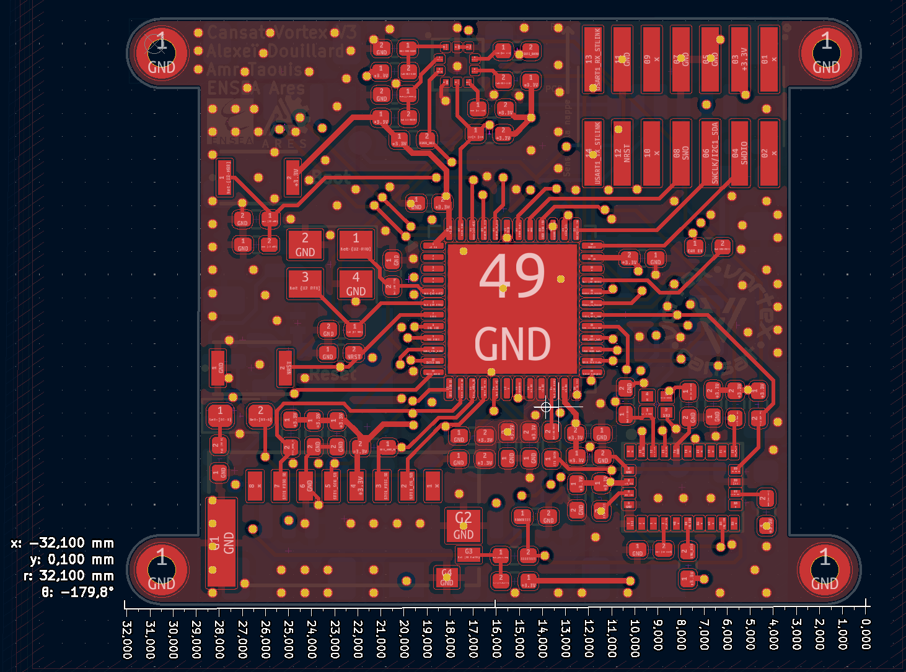<br><br>
  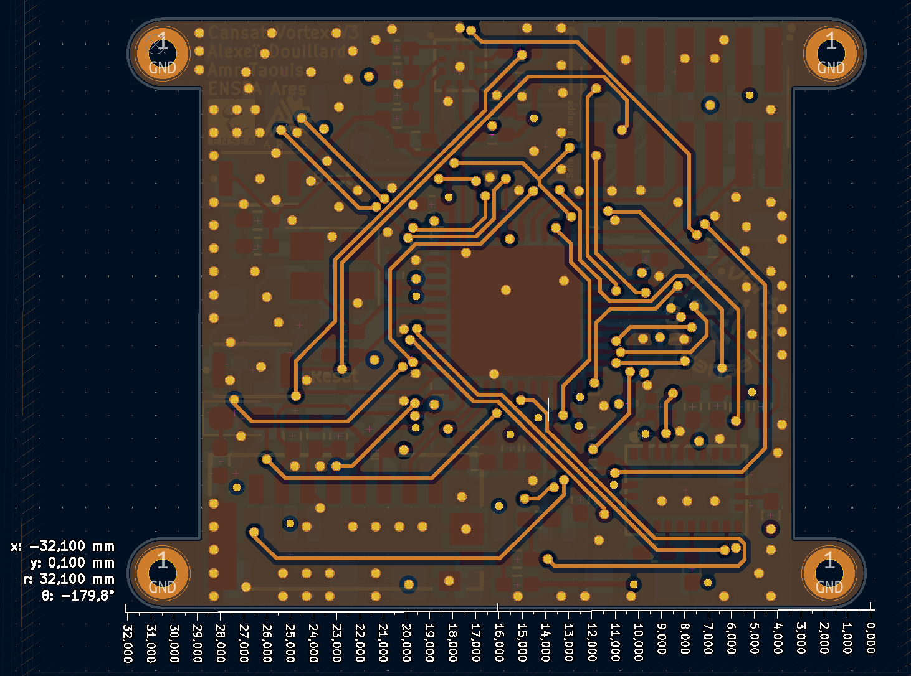<br><br>
  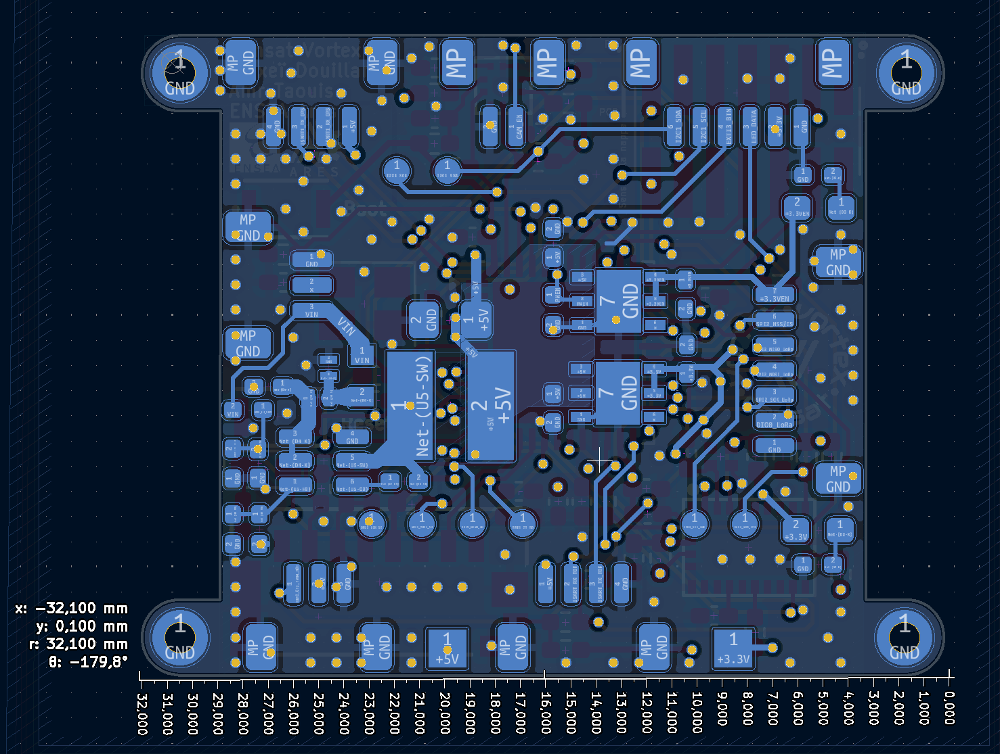
</div>

And here are the rendered 3D models of the board.

**Front side**: STM32 (center), barometer (top), JTAG connector (top right), IMU (bottom right), SD card reader (bottom left), status LEDs and buttons (left).
There are two oscillators: a 12 MHz clock for the STM32 (to its left) and a 32.768 kHz clock for the IMU (above the IMU).

<div align="center">
  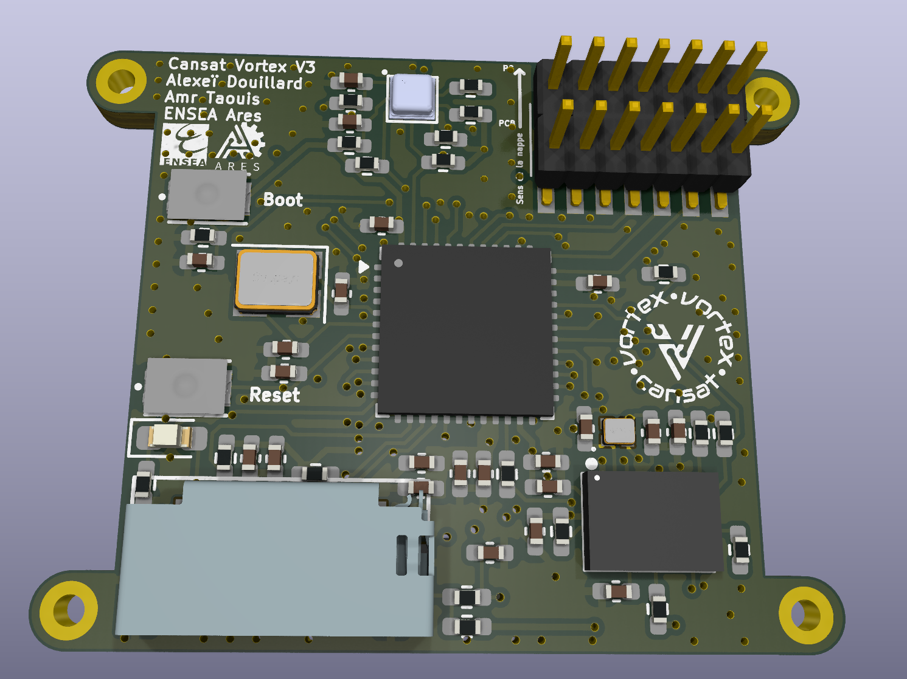
</div>

**Back side**: VBAT → 5 V buck converter (top left), main 3.3 V LDO (center right) and a second 3.3 V LDO with an enable function for the LoRa module (bottom left). Connectors to the external modules:
- Motor (top left)
- Time-of-flight sensor (top right)
- LoRa module (right)
- HMI — *see next section* (bottom right)
- GNSS (bottom left)
- 7.4 V battery (right)

There are also two power test points: one for the 5 V rail (top left) and one for the main 3.3 V rail (top right).
The remaining test points expose the onboard components (SD card, IMU, barometer); their pinout can be found in the KiCad project.

The motor output turned out not to be necessary, but we kept it as it leaves room to implement new features if needed.

<div align="center">
  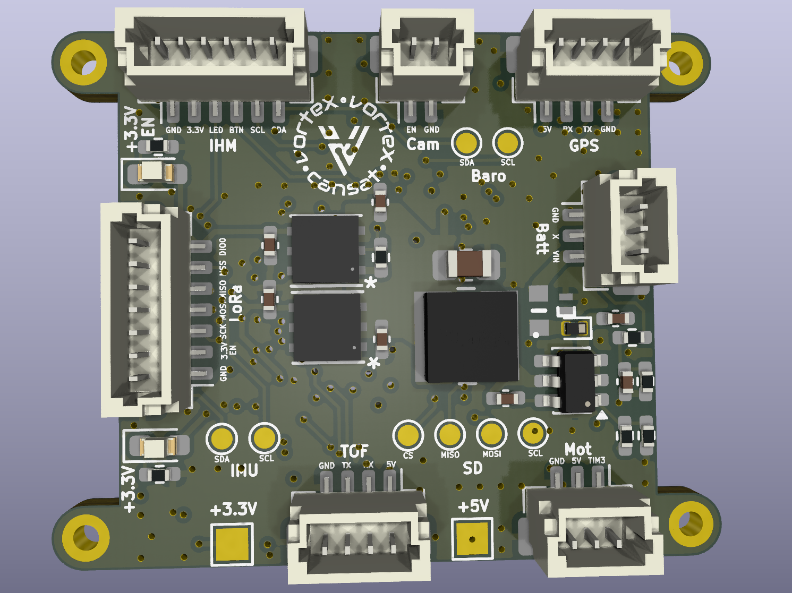
</div>

> ⚠️ **Warning!** The V1 board has a mistake in the buck converter's footprint: we had to rewire it manually so it could power the rest of the mainboard. There is also a mistake in the routing of the switchable 3.3 V rail: the enable-controlled 3.3 V supply was meant to feed the LoRa connector but was mistakenly wired to the GNSS connector.
> Both issues were fixed in V2, and the latest version, V3, is a cleaner design with additional electrical protections.

The V2 and V3 boards are fully functional; however, some rework was needed to bring out the new UART camera pins in place of the original camera-enable pin. The changes concern the ADC of the battery measurement circuit and the HMI button interrupt.

On the picture below (V1 board): the blinking blue LED is driven by the microcontroller, and the red LEDs indicate that the LDOs are running — one is on by default, the other one is enabled by the microcontroller.

<div align="center">
  
</div>

#### HMI PCB
We also developed a secondary HMI (Human-Machine Interface) PCB (2 layers). This board communicates with the mainboard over I2C to drive an onboard status screen. It also carries two addressable LEDs, providing a programmable visual feedback system to monitor the CanSat's state before and during the launch.

<div align="center">
  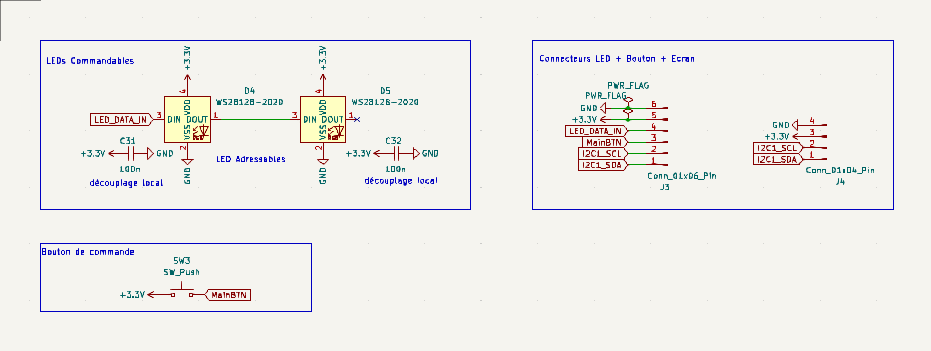<br><br>
  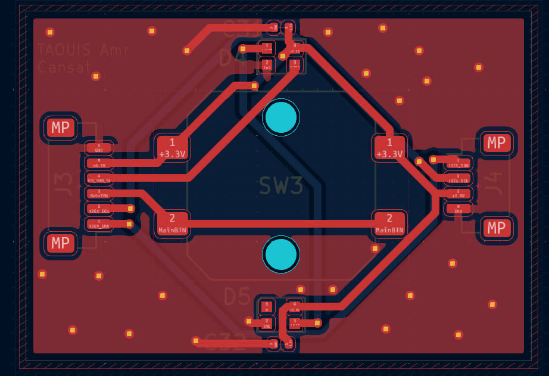<br><br>
  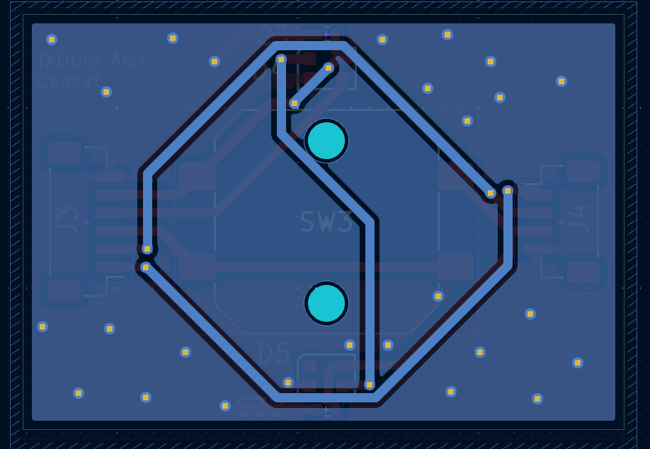
</div>

The HMI PCB was tested in integration with an OLED screen and a Nucleo development board. The display correctly shows the CanSat system status (LoRa link state, battery level), and the onboard button cycles through the information screens. A short circuit between GND and 3.3 V appeared after re-soldering a loose LED and was resolved. A custom enclosure for the HMI PCB and the OLED screen was designed in Onshape so they fit inside a handheld remote-control casing. The final step for the HMI PCB was to connect it to the mainboard, so the display shows the actual real-time status of the onboard components instead of test values.

<div align="center">
  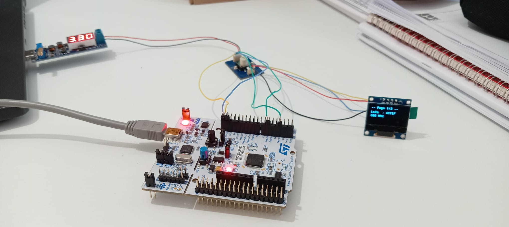<br><br>
  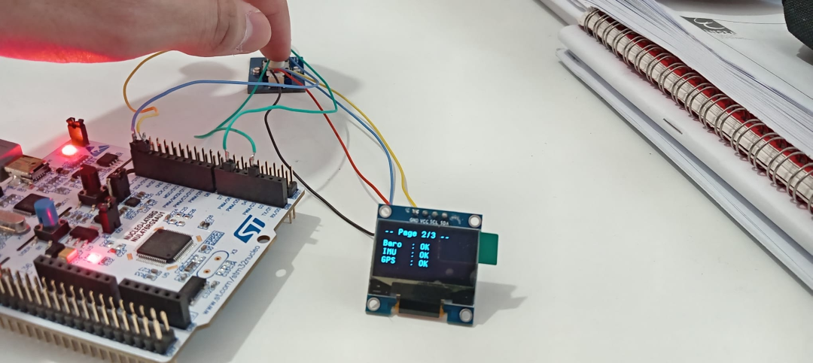<br><br>
  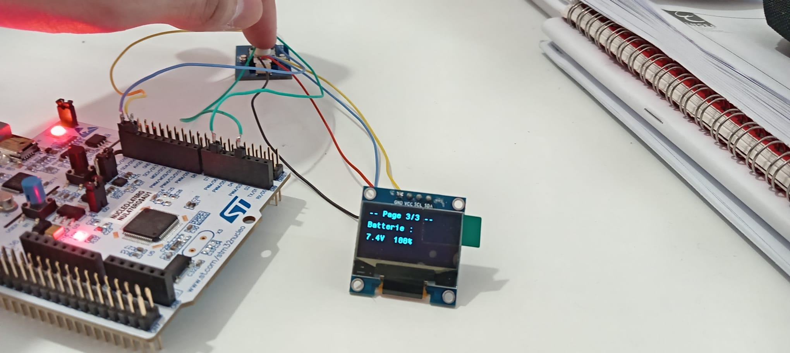<br><br>
</div>

### ⚙️ Mechanical Design

#### CanSat Core
Our CanSat is split into two independent sections:
- The **upper section** (nicknamed "Pepe") has a spring-loaded triple-fairing opening. The fairing is kept closed by a trigger, which is pulled out by the drogue chutes. To calibrate the altitude at which the trigger is released, we change the number of chained drogue chutes (detailed below).
- The **lower section** (nicknamed "Latz") holds the entire electronics skeleton (nicknamed "Gravitsappa"). It is decoupled from the top by an M5 bearing and carries a spiral running all around the body to induce a spin — this spin is what lets our LiDAR scan the ground in a spiral pattern as the CanSat falls. This is also why the upper section has vertical fins: they prevent the parachute from spinning along.

The mechanical schematic is available [here as a PDF](./Hardware/3D_Modeling/Cansat%20Schematic%20SCAE.pdf) or [here as the Onshape project](https://cad.onshape.com/documents/c1d9fbb7572429731402c7f6/w/9922ef0afe1ea96367c92f22/e/19dd7d98b534d5ce389091af).
<div align="center">
  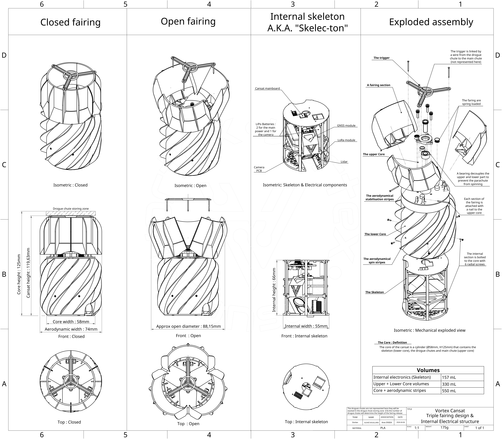
</div>
<div align="center">
  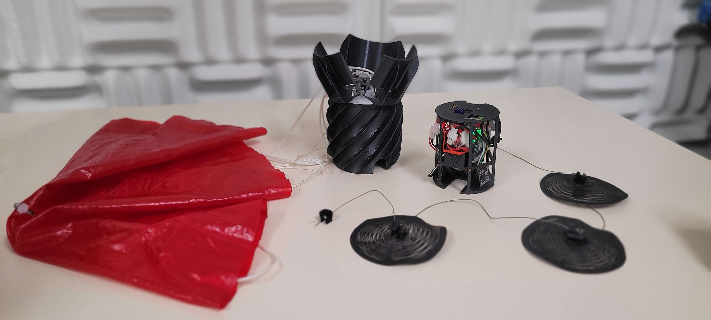
</div>
<table style="width:100%;">
  <tr>
    <td style="text-align:left;">
      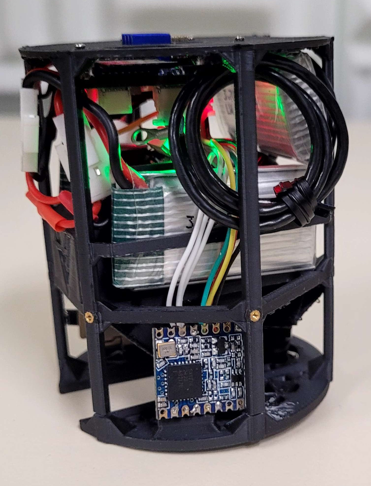
    </td>
    <td style="text-align:center;">
      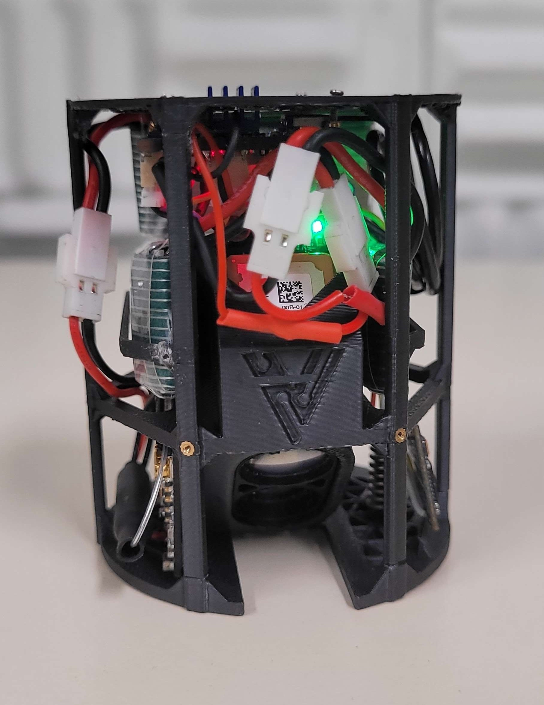
    </td>
    <td style="text-align:right;">
      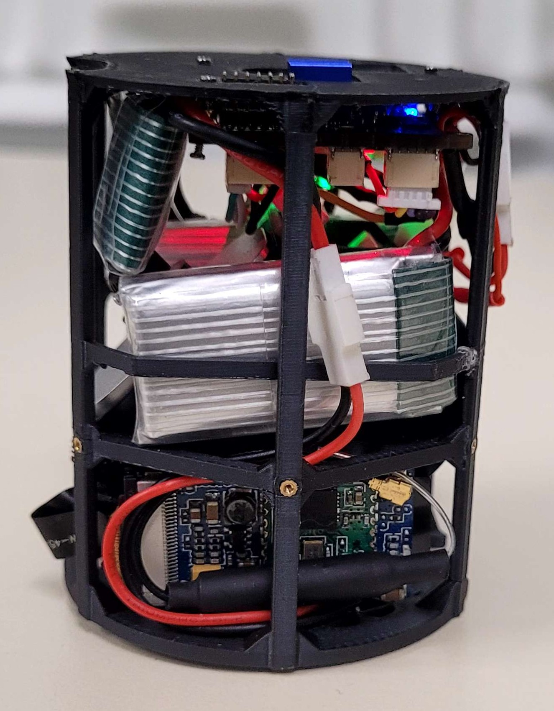
    </td>
  </tr>
</table>

#### Drogue chutes
The drogue chute is a kirigami-inspired parachute (*see the research paper in the resources section*). We laser-cut these parachutes out of a K-Way jacket, which we found to offer the best compromise between strength and flexibility.

<div align="center">
  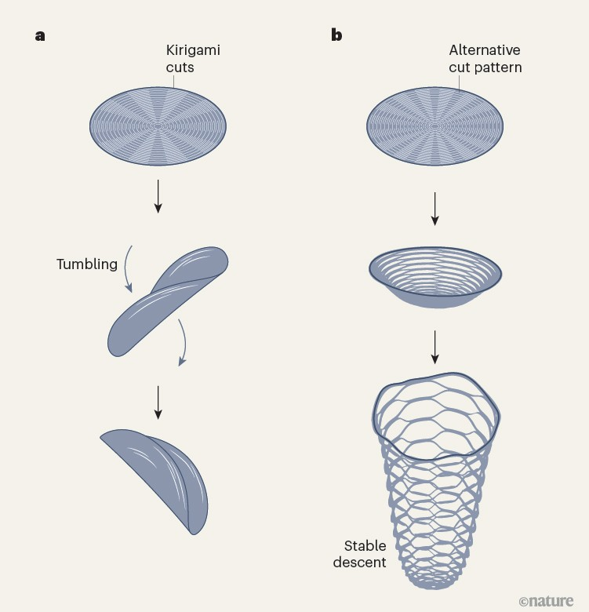
</div>

Example of chained drogue chutes used to increase the pulling force:
<div align="center">
  
</div>

#### Main parachute
The parachute was sized using the fundamental principle of dynamics at steady-state descent velocity (mg = ½ρC_dSV²). Targeting a descent speed between 2 and 5 m/s, we obtained a canopy area of approximately 0.116 m², i.e. a diameter of approximately 0.385 m, and settled on a 45 cm parachute. This choice was discussed with and approved by an aerospace specialist. Our round canopy was purchased from Klima.

<div align="center">
  
</div>

### 🧠 RTOS Software Architecture

To ensure deterministic execution, prevent data starvation and keep the 3D topographical mapping synchronized, the CanSat's flight software is built on **FreeRTOS**. We implemented a **10 Hz unified-snapshot architecture**: sensor data is gathered, fused and dispatched to both the ground station and the onboard SD card simultaneously.

The system is divided into concurrent tasks communicating safely through RTOS queues (`qSensorEvents`, `qLoRa`, `qSDCard`):

#### 🧵 Task Management
- **`TaskFSM` (normal priority):** the brain of the satellite. It evaluates the flight state at 20 Hz, handles the LED visual feedback and acts as the master metronome. Every 100 ms (10 Hz), it requests sensor readings and builds a unified `TelemetryPacket_t` that feeds the communication and storage queues.
- **`TaskSensors` (high priority):** the data gatherer. It processes hardware interrupts and I2C/UART streams to extract data from the BMP581 (barometer with thermal feed-forward compensation), the BNO055 (Euler angles, quaternions and gyro), the LW20/C (LiDAR distance) and the SAM-M10Q (background NMEA parsing).
- **`TaskLoRa` (low priority):** the communicator. It serializes the unified telemetry struct into our custom **v2.4** comma-separated protocol and transmits it through the SX1276 module. It also handles standby broadcasts and the guaranteed-delivery calibration handshake.
- **`TaskSDCard` (low priority):** the data logger. It uses the **FATFS** library over a custom low-level SPI driver to mount a MicroSD card and log the flight into two CSV files per session (`DATA_xxx.CSV` at 10 Hz, `LIDA_xxx.CSV` at up to 50 Hz). To prevent hardware bottlenecks during high-speed laser mapping, it batches `f_sync()` calls, safely committing the data to the flash without stalling the RTOS.
- **`TaskHMI`:** drives the OLED status screen and the configuration button of the HMI PCB.

#### 🔄 Finite State Machine (FSM)
The CanSat operates fully autonomously. Flight states are evaluated dynamically from environmental triggers detected by the sensor fusion (primarily combining the LiDAR and the barometer).

<div align="center">
   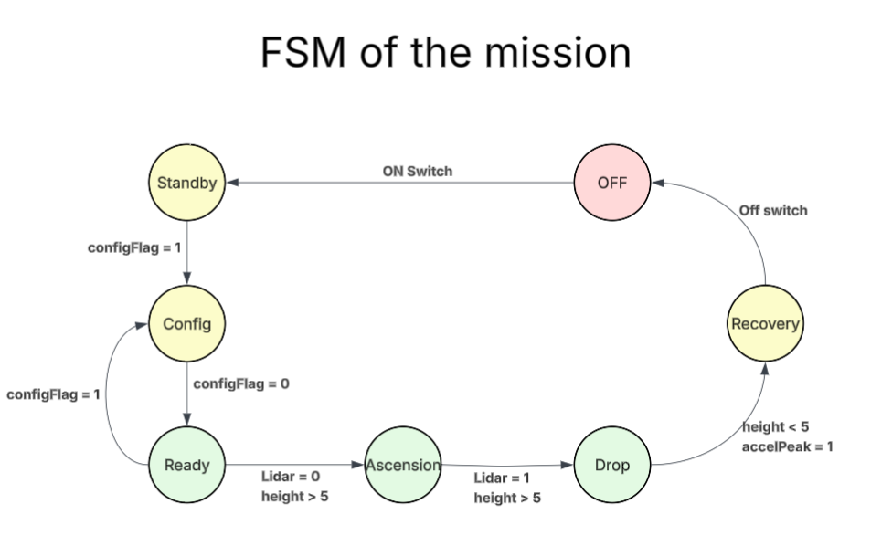
</div>

<br>

| State | Name | Description | In Transition | Out Transition | Power Supply | LIDAR | Barometer | GNSS | LoRa | IMU |
| :---: | :--- | :--- | :--- | :--- | :---: | :---: | :---: | :---: | :---: | :---: |
| **OFF** | Off state | The power switch is OFF; nothing is powered. | `powerSwitch = 0` | `powerSwitch = 1` | 🔴 OFF | 🔴 OFF | 🔴 OFF | 🔴 OFF | 🔴 OFF | 🔴 OFF |
| **S0** | Standby | Idle mode, waiting for configuration. Low consumption. | `powerSwitch = 1` | `conFlag = 1` | 🟢 ON | 🔴 OFF | 🟢 ON | 🟢 ON | 🔴 OFF | 🔴 OFF |
| **S1** | Config | Configuration mode entered when the status interface is connected. Exits when unplugged. | `conFlag = 1` | `conFlag = 0` | 🟢 ON | 🟢 ON | 🟢 ON | 🟢 ON | 🟢 ON | 🟢 ON |
| **S2** | Ready | Waiting for the ascent (or a return to configuration). | `conFlag = 0` | `lidar = 0` and `height > 5` | 🟢 ON | 🟢 ON (Low Power) | 🟢 ON | 🟢 ON | 🟢 ON | 🟢 ON |
| **S3** | Ascension | Ascent phase; the device waits for the drop. | `lidar = 0` and `height > 5` | `lidar = 1` and `height > 5` | 🟢 ON | 🟢 ON (Low Power) | 🟢 ON | 🟢 ON | 🟢 ON | 🟢 ON |
| **S4** | Drop | Descent phase; all sensors are ON. High consumption. | `lidar = 1` and `height > 5` | `height < 5` | 🟢 ON | 🟢 ON | 🟢 ON | 🟢 ON | 🟢 ON | 🟢 ON |
| **S5** | Recovery | Final steady state, waiting for recovery and data extraction. | `height < 5` | `powerSwitch = 0` | 🟢 ON | 🔴 OFF | 🔴 OFF | 🟢 ON | 🟢 ON | 🔴 OFF |

In the implementation, every transition is **debounced**: the triggering condition must hold for a fixed window (1–3 s at 20 Hz depending on the transition) with only a few outlier samples tolerated, which makes the FSM robust to isolated noisy readings.

### 📊 Data Acquisition & Routing Flow

The CanSat's data pipeline is designed to be asynchronous, modular and highly reliable. Data is gathered from four distinct sensors across different communication buses, packaged into independent C structures, and finally routed to the two storage and transmission endpoints.

Here is the breakdown of the data acquisition architecture:

#### 1. Sensor Inputs & Protocols
The system continuously listens to four hardware interfaces:
* **GNSS (UART):** receives continuous NMEA frames from the satellites (10 Hz fix rate).
* **Barometer (I2C):** polled for high-precision atmospheric pressure and temperature.
* **IMU (I2C):** read by DMA for the onboard sensor-fused orientation and acceleration.
* **LIDAR (UART):** receives high-speed distance measurements from time-of-flight laser pulses (up to 50 Hz).

#### 2. Data Encapsulation (The Structs)
To keep the data organized and synchronized, each sensor's readings are immediately packed into a dedicated `struct`. Every struct includes a **timestamp** captured at the exact millisecond the data was read, ensuring proper synchronization for post-flight analysis.

* **GNSS struct:** `timestamp`, `latitude`, `longitude`, `altitude`, `satellites`
* **Barometer struct:** `timestamp`, `height`, `temperature`
* **IMU struct:** `timestamp`, `head` (yaw), `pitch`, `roll`, `accelX`, `accelY`, `accelZ`
* **LIDAR struct:** `timestamp`, `distance`

#### 3. Data Destinations
Once the individual structures are populated, the FSM gathers them into a single unified master packet (`TelemetryPacket_t`). This unified snapshot is then dispatched simultaneously to two endpoints:

* 📡 **LoRa module:** the data is serialized into a comma-separated string (our custom **v2.4** protocol) and broadcast over the air at a 10 Hz dispatch rate to the Python ground station for real-time monitoring.
* 💾 **SD card:** the same data is routed to the onboard FATFS SD card over SPI. It is logged as CSV files and committed to the physical flash (`f_sync`) continuously, ensuring no data is lost on impact. The high-rate LiDAR stream gets its own file (`LIDA_xxx.CSV`, with quaternion attitude and GNSS altitude) to feed the 3D terrain reconstruction.

### 📡 Communications & Software Architecture

The software and communication architecture of the Vortex project was developed with a primary focus on data integrity and link stability, treating the telemetry stream as the mission's critical lifeline. Following a reverse-engineering analysis of the previous team's communication structure, we chose to rebuild the data transmission system to improve packet efficiency and error handling. The solution is implemented with the SX1276 module described above. To ensure the reliability of the received data, we integrated a Cyclic Redundancy Check (CRC) mechanism, which validates packet integrity before parsing begins at the ground station.

On the navigation front, the software driver for the SAM-M10Q GNSS module parses specific NMEA frames (GNGGA, GNGSA and GNRMC) to extract 3D position, velocity and satellite data. We used the u-center 2 software for the initial configuration, enabling SBAS/EGNOS support to maximize positioning accuracy. Testing was iterative, moving from indoor functional verification to long-range outdoor link tests to validate the link budget.

- **Summary**

  - **Robust LoRa Protocol**
    - **Error handling:** CRC (Cyclic Redundancy Check) and header validation automatically discard corrupted frames at the ground station.
    - **Handshaking:** a connection verification sequence ("CANSAT OK") confirms receiver readiness before mission start.

- **Advanced GNSS Integration**
  - **NMEA parsing:** the STM32 parses specific NMEA sentences:
    - **GNGGA:** global position (latitude, longitude, altitude)
    - **GNRMC:** recommended minimum navigation information
    - **GNGSA:** DOP and active satellites
  - **Accuracy optimization:** SBAS/EGNOS support activated via u-center 2 to improve vertical and horizontal precision; the GNSS altitude is also logged (`gnss_alt`) as a redundant altitude source for post-flight processing.

- **Testing & Validation**
  - **GNSS precision:** comparative tests between indoor (cold start) and outdoor environments to characterize time-to-first-fix and coordinate stability — outdoor performance is clearly better.
  - **Range testing:** line-of-sight (LoS) tests between the CanSat emitter and the ground station receiver to validate the LoRa link budget and antenna performance at distance.

**Current status:** the IMU values are integrated in the main telemetry stream; the full pipeline (sensors → LoRa/SD → analysis) has been validated during field tests.

### 🧰 Ground Station (Mission Control Center)

<div align="center">
  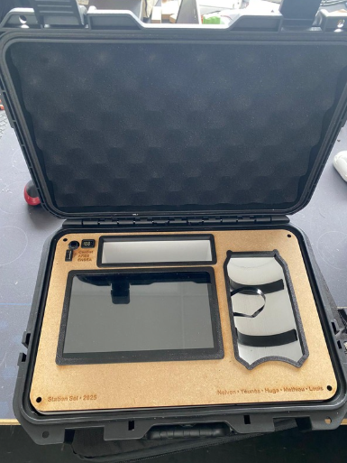
</div>

The Ground Station serves as the mission's central command and telemetry hub, engineered for high-performance data acquisition and real-time situational awareness. It is a portable, ruggedized unit built around a **Raspberry Pi 5** single-board computer.

#### **Communication & Data Link**
The station uses a **LoRa SX1276** transceiver operating at **869.53 MHz**. The link is governed by our custom **v2.4 telemetry protocol**, processing 17-field packets that carry the IMU data, GNSS coordinates, atmospheric conditions, flight phase flags and battery voltage. To ensure data integrity, the system implements hardware-level SPI communication and software-side CSV export for redundant storage.

#### **Real-Time Visualization Suite**
The ground station software is an asynchronous, multi-threaded **PyQt5** application designed for low-latency monitoring:
* **3D kinematic rendering**: uses **PyOpenGL** to visualize the satellite's orientation in real time, mapping the incoming Euler angles onto a custom STL model.
* **Dynamic geospatial tracking**: features an optimized **OpenStreetMap (OSM)** tile map engine that handles position updates in under 1 ms thanks to pre-fetched in-memory tile caching.
* **Telemetry analytics**: real-time plotting via **PyQtGraph**, deriving metrics such as vertical speed and applying a 12-sample moving average to smooth the battery voltage.
* **Mission state monitoring**: real-time flight phase indicators (Go for launch, Ascension, Drop, Recovery) decoded from the telemetry bitmask.

Detailed specifications regarding the software architecture, the SX127x configuration, the onboard logging scheme and the post-flight processing pipeline can be found in **[README_GUI.md](./README_GUI.md)**.

### 📈 Telemetry Analysis & 3D Terrain Reconstruction

All post-flight processing lives in the **[3D/](./3D/)** folder and operates on the two CSV files recovered from the SD card after each flight (`DATA_xxx.CSV` for the telemetry, `LIDA_xxx.CSV` for the LiDAR stream).

#### Telemetry analysis suite
- **`Analysis_Tools/Basic/analyze_telemetry.py`** — a 10-panel flight dashboard (accelerometer, gyroscope, orientation, temperature, altitude, vertical speed, GPS, battery), with per-phase color bands and a text report of the flight statistics.
- **`Analysis_Tools/Advanced/advanced_analysis.py`** — rotation/tumbling analysis, GPS trajectory, energy budget, automatic anomaly detection (data gaps, GPS jumps, accelerometer saturation, temperature spikes) and a Google Earth KML export.
- **`Analysis_Tools/Advanced/advanced_features.py`** — physics-based analyses: drag coefficient estimation, parachute deployment detection (vertical jerk) and battery consumption per flight phase.

#### 3D point cloud pipeline (Mission 3)
The spiral LiDAR scan is turned into a georeferenced 3D point cloud of the overflown terrain:
- **`cloudPoints.py`** fuses each range sample with the logged attitude (quaternions, SLERP-interpolated between IMU bursts) and position (GNSS + barometric or GNSS altitude), producing an interactive 3D view and optional `.xyz` exports for CloudCompare.
- **`distanceDistribution.py`** provides a quick histogram sanity check of the measured ranges.
- **`generate_sample_data.py`** generates synthetic flight data so the pipeline can be developed and tested without a launch.

The complete command-line reference is kept in [`3D/COMMANDES.txt`](./3D/COMMANDES.txt), and the full pipeline documentation is in **[README_GUI.md](./README_GUI.md)**.

#### Field test data
Real SD-card datasets recorded during our test campaigns are archived in [`backup data cansat/`](./backup%20data%20cansat/), including a 1-hour endurance test, car-drive tests and building-tour scans used to validate the LiDAR georeferencing.

### 🍃 Wind Tunnel

To test the parachutes reliably, we built a wind tunnel powered by two 350 W counter-rotating brushless drone motors. The counter-rotation ensures no unwanted swirl is induced in the flow.

<div align="center">
  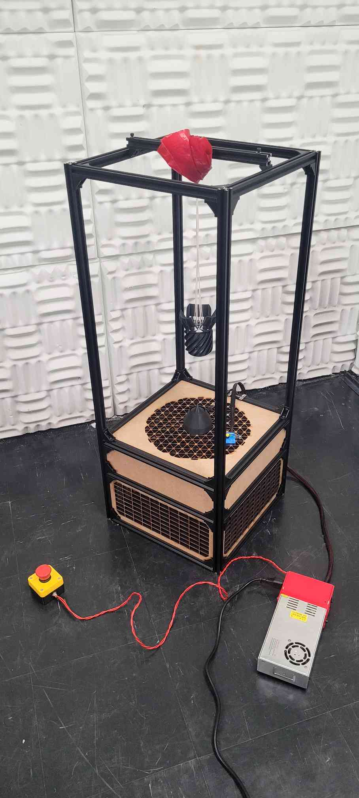
</div>

We use a servo-motor tester as the speed control (it works with both servos and brushless ESCs) and check the airspeed with an anemometer.

The device is powered by a 12 V, 30 A power supply housed in a PLA enclosure. Even without running the motors at full power, the tunnel produces a 60 km/h wind, which is more than our CanSat should reach before deployment.

<div align="center">
  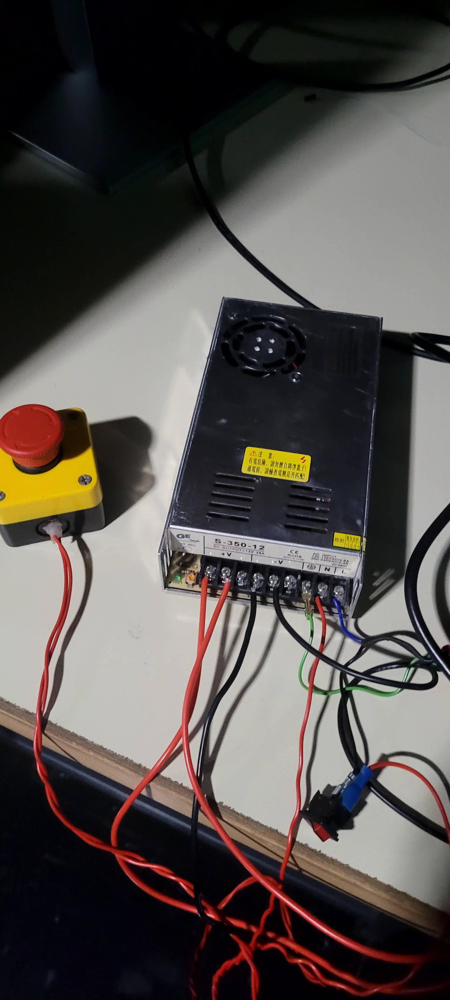
  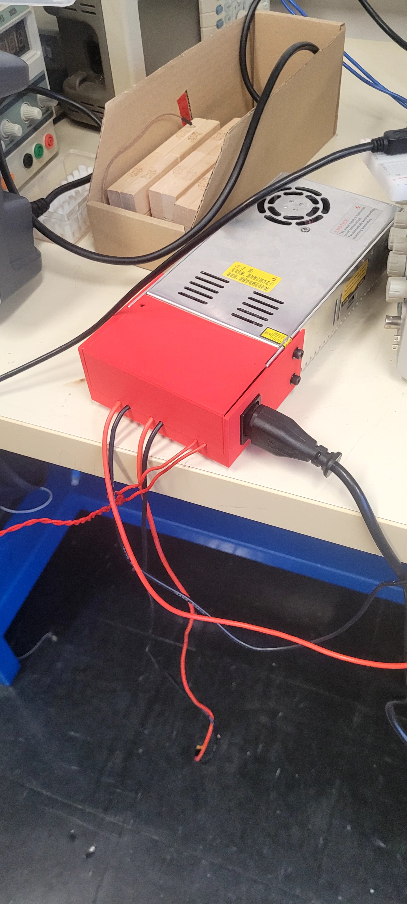
</div>

A single-fan test:

<div align="center">
  
</div>

The motor hub was covered with an aerospike-inspired nozzle in an attempt to preserve some of the airflow going around it:
<div align="center">
  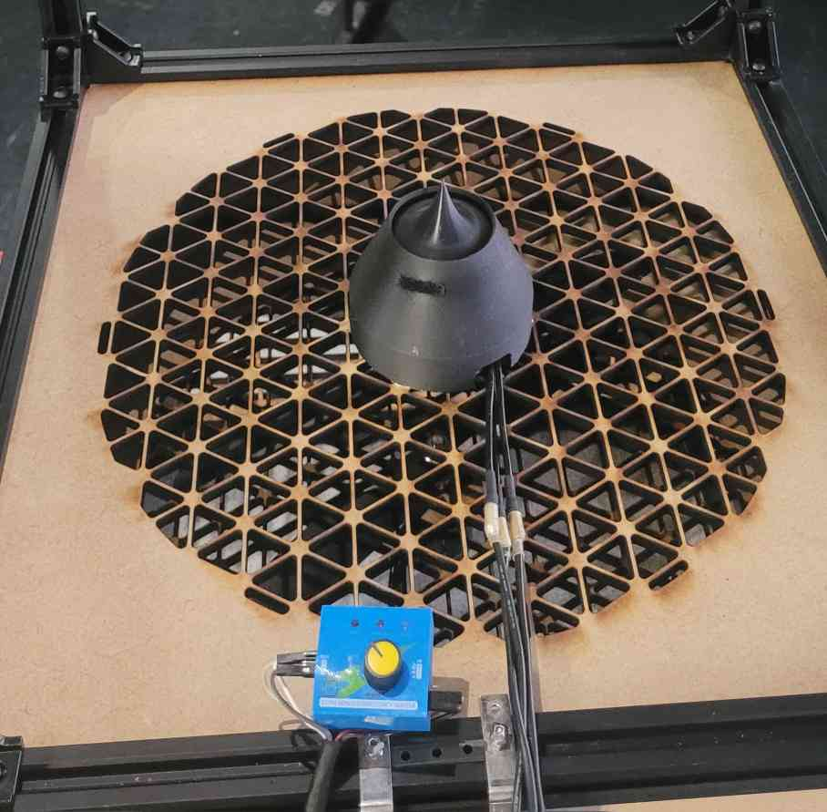
</div>

#### Precautions before use
Before operating the wind tunnel, check that the propellers are clear and that nothing can get sucked in, then plug in the power supply and turn it on (also check that the emergency stop is not engaged). The servo tester knob must be set to 0; once the ESC has emitted its three beeps, the wind tunnel is armed and ready to operate.

### ✈️ Drone

We carried out early mechanical drop tests with a heavy-duty drone that a professor kindly let us use, and we plan to build our own to run more tests.

Here is the drop mechanism:
<div align="center">
  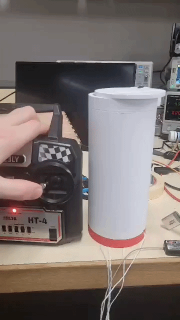
</div>

## 📚 Resources and useful links

### 👾 Software used

- u-center 2 — GNSS configuration
- LightWare Studio — LIDAR
- STM32CubeIDE v1.19.0 — STM32 firmware
- KiCad — PCB design
- Onshape — 3D modeling

### 🔗 Links

- [Previous ENSEA CanSat GitHub](https://github.com/mathieupommery/CANSAT_ARES_ENSEA)
- [Onshape folder](https://cad.onshape.com/documents?resourceType=folder&nodeId=558406456f078be48d4c722b&column=modifiedAt&sortOrder=asc)
- [Kirigami-inspired parachute (research paper)](https://www.nature.com/articles/s41586-025-09515-9#Fig1)
- [FreeRTOS guide](https://www.youtube.com/watch?v=OPrcpbKNSjU)
---

### 🚀 Future plans
The next steps are:

- Improve the deployment reliability
- Finalize the Cansat_V3 firmware iteration (barometer safety net, higher GNSS sample rate)
- Run more drone drop tests and validate the point cloud pipeline on real flight data

Given the current state of progress, we expect to complete the project on time with all of the missions fulfilled.
